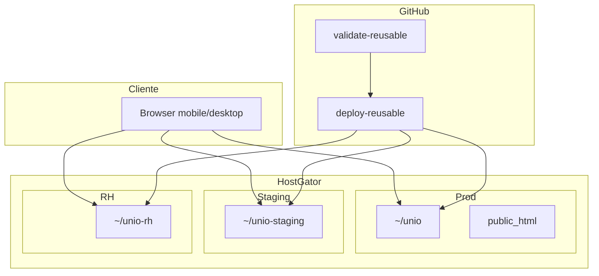

# Unio — arquitetura do sistema

Snapshot do código e do deploy em **jul/2026**.  
Complementa: [OPERACAO_INDICE.md](OPERACAO_INDICE.md) · [ESTRUTURA.md](ESTRUTURA.md) · [DEPLOY_GITHUB_ACTIONS.md](DEPLOY_GITHUB_ACTIONS.md)

---

## Resumo executivo

| Item | Valor |
|------|--------|
| **Formato** | Monólito modular (pastas + registries), não microserviços |
| **Runtime** | PHP ≥ 8.2, Symfony **7.4.\***, Doctrine ORM **3.6** |
| **UI** | Twig + AdminLTE 3 + Bootstrap 4 + Asset Mapper / Stimulus / Turbo |
| **Dados** | MariaDB/MySQL, Messenger (Doctrine transport), Mercure, Redis opcional |
| **Deploy** | HostGator × 3 (prod, staging, RH) via GitHub Actions |
| **Entidades** | ~76 em `src/Entity/` (camada flat, global) |
| **Templates** | ~495 em `templates/` |

> **Tensão central:** o produto *parece* vários hubs comerciais, mas deploy e build ainda são **um app único**. Branches `product/*` e homolog RH são **instâncias** do mesmo código (`.env.local` + pasta), não pacotes extraídos.

---

## Formato do sistema

```
Monólito modular
├── Controllers + templates  →  por módulo (RH, TI, Integrações…)
├── Services                 →  pastas por domínio maduro
├── Entity/ + Repository/    →  global (sem fronteira por módulo)
├── Security / grants        →  global (PermissionService, route maps)
└── Deploy                   →  mesmo tarball; 3 ambientes no HostGator
```

Não há bundles Symfony separados nem build-time feature flags por SKU. Maturidade varia muito entre módulos.

---

## Stack e entry points

| Camada | Implementação |
|--------|----------------|
| Entry | `public/index.php` → `App\Kernel` |
| Config | `config/packages/*`, `config/services.yaml`, `config/routes.yaml` |
| ORM | Doctrine attributes, `migrations/` |
| Assets | `importmap.php`, `npm run vendor:sync`, `public/css/unio-app.css` |
| Env | `.env`, `.env.prod.example`, `.env.staging.example`, `.env.product-rh.example` |

---

## Fluxo de request

```
HTTP
  → public/index.php
  → Security (form login, roles, remember-me 7d, AppUserChecker)
  → Controller (Auth | Core | Module\* | Api | Legal | Marketing)
  → ProductGrantSubscriber + WorkspaceService (Empresa ativa na sessão)
  → Service\* → Repository\* → Entity\*
  → Twig
  → (async) Messenger: mail, Pós-Operatório
  → (realtime) Mercure: chat, Pós-Operatório
  → (opcional) Sasha AI: Service\Sasha\SashaClient
```

---

## Camadas (`src/`)

| Diretório | Função |
|-----------|--------|
| `Controller/` | HTTP por Auth, Core, Module, Api, Legal, Marketing |
| `Service/` | Lógica de negócio (maior camada comportamental) |
| `Entity/` | Modelos Doctrine (flat, compartilhados) |
| `Repository/` | Queries |
| `Security/` | Grants, voters, `ProductGrantRouteMap`, user checker |
| `EventSubscriber/` | Workspace globals, product grants, audit, onboarding |
| `Config/` | Registries (hubs, TI, integrações, planned stubs) |
| `Twig/` | Extensions (permissões, RH, TI…) |
| `Message/` + `MessageHandler/` | Async Pós-Operatório |
| `Command/` | Seeds, validação, platform ops |
| `Rh/`, `PosOperatorio/`, `Platform/` | Catálogos e helpers de domínio (não entities) |

**Padrão:** controller resolve user + `WorkspaceService::getActiveEmpresa()` → service/repo com escopo de empresa → Twig. Acesso a produto é **segundo eixo**: route name → grant map.

---

## Multi-tenancy e autenticação

### Tenant = `Empresa`

- FK `User.empresa`, workspace ativo em sessão (`workspace_empresa_id`).
- Platform owner pode trocar empresa via `WorkspaceController`.
- Escopo por traits (`RhEmpresaScopeTrait`, etc.) e services — **sem Doctrine SQL filter**.
- Isolamento forte para clientes dedicados = host + pasta + banco + `.env` separados ([OPERACAO_CLIENTE_MATRIZ.md](OPERACAO_CLIENTE_MATRIZ.md)).

### Roles (hierarquia)

`ROLE_MEMBRO` → `SUPERVISOR_EQUIPE` → `SUPERVISOR` → `GESTOR_EQUIPE` → `GESTOR` → `ROLE_TENANT` → `ROLE_PLATFORM_OWNER`

### Product grants (segundo eixo)

- Entidade `UserProductGrant`: `(user, scope, productId, perfilGrant)`.
- Escopos: `hub_operacoes`, `product_rh`, `hub_ti`, …
- `ProductGrantSubscriber` + `PermissionService` + mapas de rotas em `ProductGrantAccess` / `ProductGrantRouteMap`.
- Config: `config/packages/security.yaml` (remember-me 604800 s = 7 dias).

---

## Módulos — maturidade

| Área | Prefixo | Maturidade | Notas |
|------|---------|------------|-------|
| **RH** | `/rh` | Profundo | Folha, ponto, férias, eSocial, portal, auditoria, organograma… |
| **TI** | `/ti` | Profundo | Chamados, KB, infra, playbooks, Helia |
| **Integrações** | `/integracoes` | Profundo | Webhooks, dead letters, shadow runs, playbooks |
| **Pós-Operatório** | `/pos-operatorio` | Profundo | Messenger + Mercure + portal paciente |
| **Core** | `/dashboard`, `/workspace` | Maduro | Chat, perfil, onboarding, welcome |
| **Pessoas** | `/pessoas` | Evoluindo | Services em `Service/Pessoas/` |
| **Hubs leves** | `/talentos`, `/maturidade`, `/engenharia`… | Hub | Agregadores, menos domínio |
| **Planned** | `/academy`, `/comercial`, `/compliance`… | Stub | `PlannedHubRegistry`, controllers finos |

Matriz comercial detalhada: [OPERACAO_CLIENTE_MATRIZ.md](OPERACAO_CLIENTE_MATRIZ.md).

---

## Dados e integrações

| Concern | Implementação |
|---------|----------------|
| **DB** | MariaDB 10.11 (local/prod); `DATABASE_URL` por ambiente |
| **Filas** | Messenger `doctrine://default` — mail, notifier, Pós-Op |
| **E-mail** | Symfony Mailer + Titan SMTP (`MAILER_DSN`) |
| **Realtime** | Mercure (`config/packages/mercure.yaml`) |
| **IA** | Sasha AI (HTTP opcional, Docker `Sasha-ai`) |
| **Cache** | Redis opcional; pools Doctrine em prod |
| **Uploads** | Filesystem local (RH, TI, anexos) |

---

## Deploy e ambientes

| Branch | URL | App no servidor |
|--------|-----|-----------------|
| `production` | https://uniowork.com.br | `/home2/joabef36/unio` + `public_html` |
| `new_staging` | https://staging.uniowork.com.br | `/home2/joabef36/unio-staging` |
| `product/rh` | https://rh.uniowork.com.br | `/home2/joabef36/unio-rh` |

Fluxo: `validate-reusable` → `deploy-reusable` (SSH `br1136.hostgator.com.br:2222`) → smoke test.

Detalhes: [DEPLOY_GITHUB_ACTIONS.md](DEPLOY_GITHUB_ACTIONS.md) · [OPERACAO_BRANCHES_DEPLOY.md](OPERACAO_BRANCHES_DEPLOY.md).

---

## Pontos fortes (evidência no código)

1. **Baseline moderno** — Symfony 7.4, PHP 8.2, autowiring, Flex.
2. **Ops maduras** — Actions reutilizáveis, preflight SSH, smoke, docs operacionais.
3. **Permissões em camadas** — roles globais + grants por produto + workspace.
4. **Módulos profundos** — RH, TI, Integrações, Pós-Op com services, catálogos e Twig extensions.
5. **CI** — PHPStan, PHPUnit, lint Twig/YAML/container, `app:validate-system`.

---

## Upgrades prioritários

Ordenado por impacto arquitetural (jul/2026).

| Pri | Oportunidade | Impacto | Esforço | Motivo |
|-----|--------------|---------|---------|--------|
| **P0** | Tenant no infrastructure layer | Alto | Médio | Escopo ad hoc; query sem `empresa` = risco cross-tenant |
| **P0** | Quebrar `PermissionService` / grant maps | Alto | Médio–alto | Política em strings de rota — frágil ao crescer |
| **P1** | Fronteiras reais de módulo (entities) | Alto | Alto | `Entity/` flat impede SKU RH-only ou pacotes |
| **P1** | Alinhar branches vs operação | Médio | Baixo–médio | Docs feature→product; dia a dia é production-first |
| **P1** | Testes em grants + tenant | Alto | Médio | ~41 arquivos de teste vs dezenas de controllers |
| **P2** | Unificar frontend | Médio | Alto | Bootstrap 4 + AdminLTE + jQuery + Stimulus/Turbo |
| **P2** | Mais async (eSocial, integrações) | Médio | Médio | Só mail e Pós-Op no Messenger hoje |
| **P2** | Encolher stubs em prod | Médio | Baixo–médio | Academy, comercial… aumentam superfície |
| **P3** | `APP_DEBUG` / remember-me secret | Alto se errado | Trivial | `.env.prod.example`; secret acoplado a `APP_SECRET` |

### Próximo estágio — decisão estratégica

| Caminho | Quando faz sentido |
|---------|-------------------|
| **A — Pacotes / fronteiras por módulo** | SKUs separados (RH-only), clientes dedicados, times por produto |
| **B — Monólito explícito** | Um deploy, hubs como feature flags; simplificar narrativa de branches |

Enquanto a decisão não for tomada, **P0 (tenancy + grants)** traz mais segurança que refatoração de UI.

---

## Diagrama simplificado



---

## Arquivos de referência

| Tema | Onde olhar |
|------|------------|
| Security | `config/packages/security.yaml` |
| Grants | `src/Security/ProductGrantAccess.php`, `src/Service/PermissionService.php` |
| Workspace | `src/Service/WorkspaceService.php` |
| Estrutura de pastas | `docs/ESTRUTURA.md` |
| Workflows | `.github/workflows/` |
| Deploy SSH | `config/deploy-hostgator.defaults.env` |

---

*Documento gerado a partir de review do repositório em jul/2026. Atualize após mudanças estruturais relevantes (novo módulo extraído, tenant filter, etc.).*
