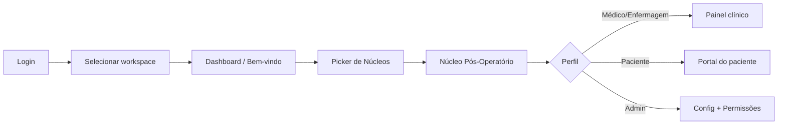
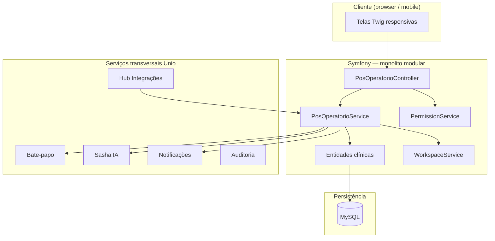
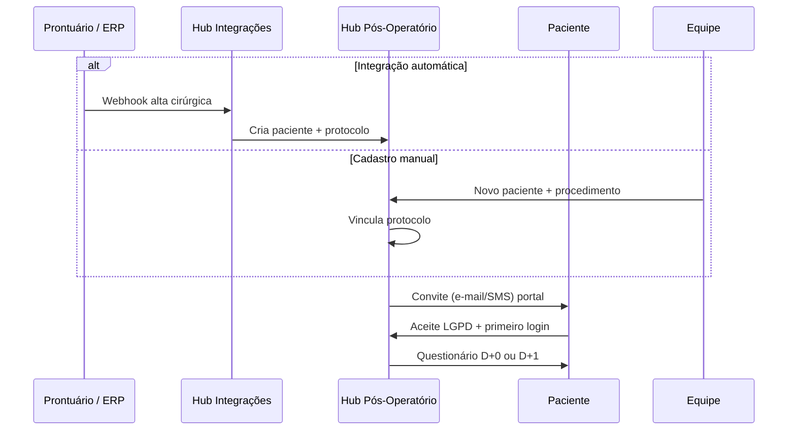
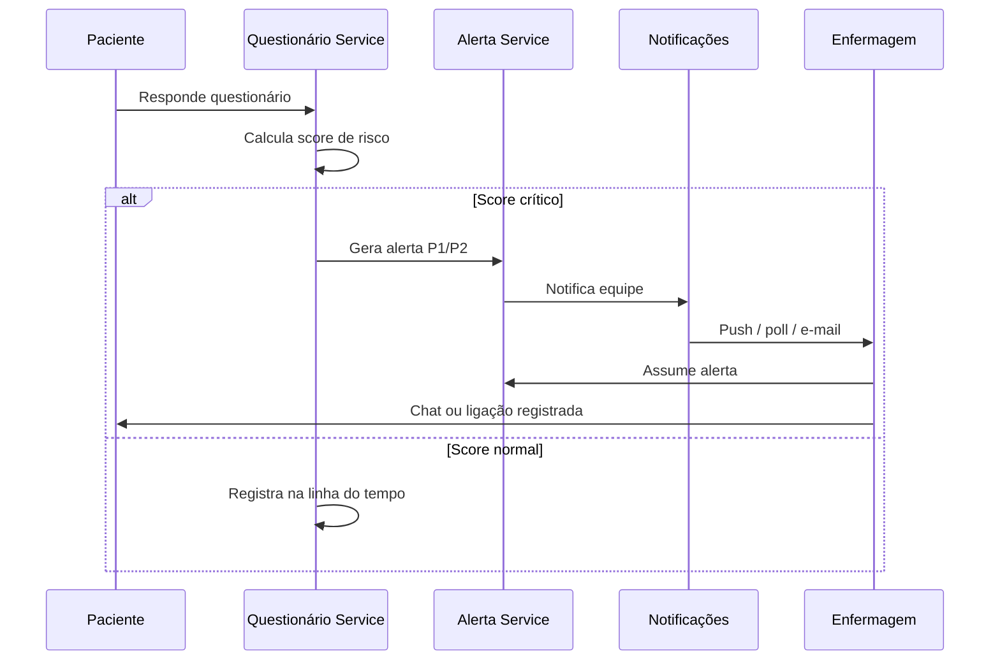
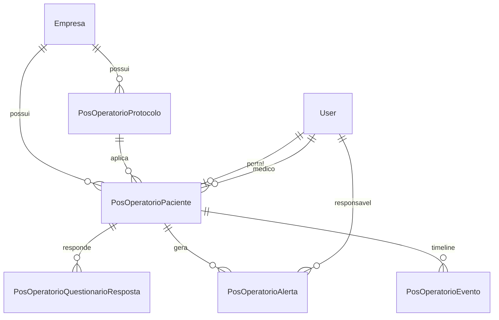

# Integração do Hub Pós-Operatório na Plataforma Unio

Documentação completa de como o **sistema de acompanhamento pós-operatório** proposto pelo Professor Paulo se integra à arquitetura, navegação, permissões e serviços transversais da plataforma Unio.

> **Documento relacionado:** [HUB_POS_OPERATORIO.md](./HUB_POS_OPERATORIO.md) (resumo executivo)  
> **Download PDF:** [HUB_POS_OPERATORIO_INTEGRACAO.pdf](./HUB_POS_OPERATORIO_INTEGRACAO.pdf) · para regerar: `npm run docs:pos-operatorio-pdf`  
> **Rota atual (preview):** `/pos-operatorio` · **Escopo:** `hub_pos_operatorio`

---

## Índice

1. [Contexto da proposta](#1-contexto-da-proposta)
2. [Como aparece na plataforma](#2-como-aparece-na-plataforma)
3. [Arquitetura Unio e ponto de encaixe](#3-arquitetura-unio-e-ponto-de-encaixe)
4. [Módulos, telas e experiência do usuário](#4-módulos-telas-e-experiência-do-usuário)
5. [Personas, permissões e matriz de acesso](#5-personas-permissões-e-matriz-de-acesso)
6. [Fluxos operacionais](#6-fluxos-operacionais)
7. [Integração com serviços existentes](#7-integração-com-serviços-existentes)
8. [Modelo de dados](#8-modelo-de-dados)
9. [API, webhooks e prontuário externo](#9-api-webhooks-e-prontuário-externo)
10. [Segurança, LGPD e dados sensíveis](#10-segurança-lgpd-e-dados-sensíveis)
11. [Roadmap de implementação](#11-roadmap-de-implementação)
12. [Estado atual no repositório](#12-estado-atual-no-repositório)
13. [Anexo: comparativo Hub TI × Hub Pós-Operatório](#13-anexo-comparativo-hub-ti--hub-pós-operatório)

---

## 1. Contexto da proposta

### O que foi solicitado

Um **sistema de acompanhamento pós-operatório** que permita à clínica/equipe médica:

- acompanhar pacientes após a cirurgia de forma estruturada;
- receber sinais de alerta quando algo foge do esperado;
- centralizar comunicação e histórico (sem depender de WhatsApp solto ou planilhas);
- escalar para a equipe quando houver risco clínico.

### Por que encaixa na Unio

A Unio não é um prontuário eletrônico (PEP) completo — é uma **plataforma operacional multi-empresa** com hubs modulares. O pós-operatório entra como **mais um núcleo**, reutilizando:

| Capacidade Unio | Uso no pós-operatório |
|-----------------|----------------------|
| Workspace isolado por clínica | Cada unidade com dados separados |
| Permissões granulares | Médico, enfermagem, paciente, admin |
| Hub TI (alertas, SLA, War Room) | Alertas clínicos P1–P4 |
| RH (workflows + checklist) | Protocolo pós-cirúrgico por fases |
| Bate-papo | Comunicação paciente ↔ equipe |
| Sasha IA | Orientações e triagem |
| Hub Integrações | Alta cirúrgica vinda do PEP/ERP |
| Notificações + Mercure | Alertas em tempo real |

---

## 2. Como aparece na plataforma

### 2.1 Jornada do usuário na Unio



### 2.2 Onde fica no menu

| Elemento | Valor |
|----------|-------|
| **Grupo na sidebar** | Operações & Ativos (`operacoes_ext`) |
| **Label** | Núcleo Pós-Operatório |
| **Ícone** | `fa-heart-pulse` |
| **Rota** | `/pos-operatorio` (`app_pos_operatorio`) |
| **Escopo de permissão** | `hub_pos_operatorio` |

Fica ao lado de núcleos como **SST**, **Saúde Ocupacional** e **Qualidade** — domínio clínico-operacional, não RH corporativo.

### 2.3 Estrutura visual do hub (layout Unio)

O hub usa o **layout padrão de núcleos** (`templates/layout/hub.html.twig`):

```
┌─────────────────────────────────────────────────────────────┐
│  Toolbar: título · subtítulo · ações (ex.: + Novo paciente)   │
├─────────────────────────────────────────────────────────────┤
│  Abas: [ Visão geral ] [ Permissões ]                        │
├─────────────────────────────────────────────────────────────┤
│  KPIs: Pacientes ativos · Alertas · Questionários · SLA      │
├─────────────────────────────────────────────────────────────┤
│  Conteúdo da aba ativa (overview, listagens, formulários)    │
└─────────────────────────────────────────────────────────────┘
```

**Preview atual** (`templates/modules/pos-operatorio/overview.html.twig`):

- KPIs ilustrativos (pacientes ativos, alertas, questionários, tempo de resposta);
- tabela de pacientes recentes;
- painel de alertas P1/P2;
- cards dos 6 módulos do núcleo;
- card **Sasha · Insight** com sugestão operacional.

### 2.4 Produtos internos do núcleo

Cada produto é uma área com permissão independente:

| ID produto | Label | Descrição |
|------------|-------|-----------|
| `pacientes` | Pacientes | Cadastro pós-cirúrgico, ficha, linha do tempo |
| `protocolos` | Protocolos | Templates por tipo de procedimento |
| `questionarios` | Questionários | Formulários diários e histórico de respostas |
| `alertas` | Alertas clínicos | Fila de alertas, prioridade, SLA |
| `painel` | Painel médico | Dashboard, KPIs, relatórios |
| `portal_paciente` | Portal do paciente | Visão mobile simplificada para o paciente |

---

## 3. Arquitetura Unio e ponto de encaixe

### 3.1 Stack

| Camada | Tecnologia |
|--------|------------|
| Backend | PHP 8.2, Symfony 7.4 |
| ORM | Doctrine 3 + MySQL |
| Templates | Twig |
| UI | CSS Unio (`unio-app.css`), AdminLTE, Stimulus |
| Tempo real | Mercure (chat, notificações live) |
| Cache prod | Redis |
| Segurança | Symfony Security + grants por escopo/produto |

### 3.2 Modelo arquitetural



### 3.3 Multi-empresa (workspace)

Toda operação clínica é **escopada por `Empresa`**:

- Clínica A e Clínica B = workspaces distintos;
- pacientes, protocolos e alertas **nunca cruzam** empresas;
- white-label (logo, cores, slogan) por workspace via configurações admin;
- usuário com acesso a várias clínicas troca workspace em um clique.

Implementação: `WorkspaceService::getActiveEmpresa()` — mesmo padrão de RH, TI e Recrutamento.

### 3.4 Padrão de código do hub

```
src/
├── Controller/Module/PosOperatorio/
│   ├── PosOperatorioController.php          # Hub overview
│   ├── PosOperatorioPacienteController.php  # (fase 2) CRUD pacientes
│   ├── PosOperatorioProtocoloController.php # (fase 2) protocolos
│   └── PosOperatorioAlertaController.php    # (fase 2) fila de alertas
├── Service/PosOperatorio/
│   ├── PosOperatorioService.php             # Dashboard e orquestração
│   ├── PosOperatorioPacienteService.php
│   ├── PosOperatorioProtocoloService.php
│   ├── PosOperatorioQuestionarioService.php # Motor de perguntas + score
│   ├── PosOperatorioAlertaService.php       # Regras P1–P4 + SLA
│   └── PosOperatorioGrantService.php        # Checagem de grants (opcional)
├── Entity/
│   ├── PosOperatorioPaciente.php
│   ├── PosOperatorioProtocolo.php
│   ├── PosOperatorioQuestionarioResposta.php
│   ├── PosOperatorioAlerta.php
│   └── PosOperatorioEvento.php
├── Repository/
└── Security/
    └── PosOperatorioGrantPolicy.php         # (opcional) políticas finas

templates/modules/pos-operatorio/
├── overview.html.twig
├── pacientes/
├── protocolos/
├── alertas/
└── portal/                                  # visão paciente (mobile-first)
```

**Convenção:** `private const T = 'modules/pos-operatorio/';` nos controllers — igual RH e TI.

### 3.5 Registro do núcleo (já feito)

| Artefato | Arquivo |
|----------|---------|
| Catálogo de hubs | `src/Config/PlannedHubRegistry.php` |
| Escopos e produtos | `src/Service/PermissionService.php` |
| Mapa rota → grant | `src/Security/ProductGrantRouteMap.php` |
| Navegação / back | `src/Service/PageBackResolver.php` |
| Onboarding hub | `src/EventSubscriber/OnboardingHubVisitSubscriber.php` |

Para adicionar novas rotas de produto, repetir o padrão documentado em `docs/QUALIDADE_PERFORMANCE_E_HUBS.md`.

---

## 4. Módulos, telas e experiência do usuário

### 4.1 Mapa de telas (visão final)

| Tela | Rota prevista | Quem acessa |
|------|---------------|-------------|
| Visão geral | `/pos-operatorio` | Equipe clínica |
| Lista de pacientes | `/pos-operatorio/pacientes` | Médico, enfermagem |
| Ficha do paciente | `/pos-operatorio/pacientes/{id}` | Equipe (escopo) |
| Novo paciente | offcanvas / modal | Médico (GESTOR) |
| Protocolos | `/pos-operatorio/protocolos` | Admin, médico |
| Editor de protocolo | `/pos-operatorio/protocolos/{id}` | Admin |
| Fila de alertas | `/pos-operatorio/alertas` | Enfermagem, médico |
| Detalhe do alerta | `/pos-operatorio/alertas/{id}` | Responsável |
| Questionário (paciente) | `/pos-operatorio/portal` | Paciente (MEMBRO) |
| Responder hoje | `/pos-operatorio/portal/hoje` | Paciente |
| Permissões | aba no hub | Gestor |
| Relatórios | `/pos-operatorio/relatorios` | Gestor, médico |

### 4.2 Visão geral — equipe clínica

```
┌──────────────────┬──────────────────┬──────────────────┬──────────────────┐
│ 24 Pacientes     │ 3 Alertas        │ 94% Questionários│ 1h 12m SLA       │
│ ativos           │ abertos          │ respondidos      │ resposta         │
└──────────────────┴──────────────────┴──────────────────┴──────────────────┘

┌─ Pacientes recentes ─────────────────┐  ┌─ Alertas ativos ──────────────┐
│ PO-1042  Maria S.   Artroscopia  D+3 │  │ P1  Dor intensa 8/10  6 min  │
│ PO-1041  João P.    Apendicectomia D+1│  │ P2  Febre 38,2°C     18 min  │
└──────────────────────────────────────┘  └────────────────────────────────┘

┌─ Sasha · Insight ──────────────────────────────────────────────────────┐
│ 2 pacientes em D+1 sem questionário hoje. Enviar lembrete antes das 20h. │
└──────────────────────────────────────────────────────────────────────────┘

┌─ Módulos ────────────────────────────────────────────────────────────────┐
│ [Pacientes] [Protocolos] [Questionários] [Alertas] [Painel] [Portal]     │
└──────────────────────────────────────────────────────────────────────────┘
```

### 4.3 Ficha do paciente (wireframe)

```
┌─ PO-1041 · João P. ──────────────────────────────────────────────────────┐
│ Apendicectomia · D+1 · Dr. Paulo · Status: ALERTA P2                    │
├──────────────────────────────────────────────────────────────────────────┤
│ [Linha do tempo] [Questionários] [Chat] [Documentos]                      │
├──────────────────────────────────────────────────────────────────────────┤
│ 26/06 14:32  Questionário D+1 — febre 38,2°C → Alerta P2 gerado         │
│ 26/06 09:00  Lembrete enviado — questionário pendente                   │
│ 25/06 16:00  Cadastro pós-alta — protocolo Apendicectomia vinculado     │
└──────────────────────────────────────────────────────────────────────────┘
```

### 4.4 Portal do paciente (mobile-first)

Interface simplificada, sem sidebar de núcleos:

```
┌─────────────────────────────┐
│  Olá, João 👋               │
│  Apendicectomia · Dia 1     │
├─────────────────────────────┤
│  📋 Questionário de hoje    │
│  [ Responder agora ]        │
├─────────────────────────────┤
│  💬 Falar com a equipe      │
│  🤖 Perguntar à Sasha     │
├─────────────────────────────┤
│  📖 Orientações pós-op      │
│  • Medicação                │
│  • Curativo                 │
│  • Sinais de alerta         │
└─────────────────────────────┘
```

---

## 5. Personas, permissões e matriz de acesso

### 5.1 Personas

| Persona | Perfil Unio | Produtos típicos |
|---------|-------------|------------------|
| **Médico responsável** | GESTOR / GESTOR_EQUIPE | pacientes, protocolos, alertas, painel |
| **Enfermagem** | SUPERVISOR / SUPERVISOR_EQUIPE | alertas, pacientes (leitura), questionários |
| **Paciente** | MEMBRO | portal_paciente, questionarios |
| **Admin da clínica** | GESTOR | todos + permissões + protocolos |
| **Operador plataforma** | TENANT | acesso total (multi-workspace) |

### 5.2 Matriz de permissões (DEFAULT_GRANTS)

| Membro demo | pacientes | protocolos | questionarios | alertas | painel | portal_paciente |
|-------------|-----------|------------|---------------|---------|--------|-----------------|
| gestor | GESTOR | GESTOR | GESTOR | GESTOR | GESTOR | GESTOR |
| gestor-eq | GESTOR_EQUIPE | GESTOR_EQUIPE | GESTOR_EQUIPE | GESTOR_EQUIPE | GESTOR_EQUIPE | — |
| supervisor | SUPERVISOR | — | SUPERVISOR_EQUIPE | SUPERVISOR | SUPERVISOR | — |
| membro | — | — | MEMBRO | — | — | MEMBRO |

Configurável por workspace na aba **Permissões** do hub (mesmo painel de RH/TI).

### 5.3 Isolamento paciente

- Paciente **MEMBRO** recebe grant apenas em `portal_paciente` e `questionarios`;
- queries sempre filtradas por `portalUser = :user` ou token de convite;
- equipe clínica vê pacientes do workspace ativo, respeitando grant por produto.

---

## 6. Fluxos operacionais

### 6.1 Entrada do paciente no acompanhamento



### 6.2 Questionário diário e alerta



### 6.3 Regras de alerta (exemplo)

| Condição | Prioridade | SLA resposta |
|----------|------------|--------------|
| Febre ≥ 38,5°C | P1 | 15 min |
| Febre 37,8–38,4°C | P2 | 30 min |
| Dor ≥ 8/10 | P1 | 15 min |
| Sangramento ativo | P1 | 15 min |
| Questionário não respondido 24h | P3 | 4 h |
| Dúvida Sasha não resolvida | P4 | 8 h |

*(Valores configuráveis por protocolo.)*

### 6.4 Encerramento do acompanhamento

1. Médico marca **alta do acompanhamento** (fim do protocolo ou antecipado);
2. status → `encerrado`;
3. portal do paciente passa a somente leitura;
4. relatório PDF gerado (evolução, alertas, aderência a questionários);
5. após período de retenção → anonimização conforme política LGPD.

---

## 7. Integração com serviços existentes

### 7.1 Hub TI — alertas e SLA

| Conceito TI | Equivalente pós-op |
|-------------|-------------------|
| `TiChamado` | `PosOperatorioAlerta` |
| Prioridade P1–P4 | Gravidade clínica |
| SLA por prioridade | Tempo máximo de resposta da equipe |
| War Room | Sala de crise para múltiplos P1 |
| `TiNotificationService` | Mesmo padrão de poll/notificação |
| Dashboard KPIs | Painel clínico |

**Implementação sugerida:** extrair interface comum `OperationalAlertInterface` ou reutilizar estrutura de fila/notificação do TI sem acoplar domínio clínico ao `TiChamado`.

### 7.2 RH — workflows e checklist

| Conceito RH | Equivalente pós-op |
|-------------|-------------------|
| Admissão + checklist | Início acompanhamento + protocolo |
| Offboarding | Alta do acompanhamento |
| Trilha de auditoria | Linha do tempo do paciente |
| Documentos | Termo LGPD, orientações PDF |

### 7.3 Bate-papo

- Canal por paciente ou thread vinculada à ficha;
- histórico auditável (substitui WhatsApp informal);
- integração via serviço de chat existente + `empresa_id` + referência `paciente_id`.

### 7.4 Sasha IA

Contexto injetado no prompt:

- procedimento realizado;
- dia pós-op (D+N);
- respostas recentes do questionário;
- protocolo e orientações da clínica.

Comportamento:

- responde dúvidas frequentes (“posso tomar banho?”, “dor normal?”);
- **não diagnostica** — disclaimer + escalonamento para equipe;
- respeita grants (paciente não vê dados de outros).

### 7.5 Hub Integrações

Eventos inbound (webhook):

- `pos_operatorio.alta_cirurgica` — cria paciente;
- `pos_operatorio.atualizacao_prontuario` — atualiza dados.

Eventos outbound:

- `pos_operatorio.alerta_p1` — notifica sistema externo;
- `pos_operatorio.encerramento` — devolve resumo ao PEP.

### 7.6 Notificações e Mercure

- poll de alertas (padrão `app_ti_notificacoes_poll`);
- badge na toolbar do hub;
- Mercure para atualização live da fila de alertas no painel.

### 7.7 Cortex / Analytics (fase 3)

- taxa de resposta a questionários;
- tempo médio de resposta por prioridade;
- readmissões correlacionadas (se houver dado externo);
- CSAT pós-acompanhamento.

---

## 8. Modelo de dados

### 8.1 Diagrama entidade-relacionamento



### 8.2 Tabelas

#### `pos_operatorio_protocolo`

| Campo | Tipo | Descrição |
|-------|------|-----------|
| id | int PK | |
| empresa_id | FK | Workspace |
| nome | varchar(120) | Ex.: "Apendicectomia laparoscópica" |
| tipo_procedimento | varchar(120) | Código ou categoria |
| duracao_dias | smallint | Ex.: 14 |
| checklist | json | Itens por dia (D+1, D+3…) |
| perguntas | json | Schema do questionário |
| regras_alerta | json | Limiares P1–P4 |
| ativo | bool | |

#### `pos_operatorio_paciente`

| Campo | Tipo | Descrição |
|-------|------|-----------|
| id | int PK | |
| empresa_id | FK | |
| protocolo_id | FK nullable | |
| medico_responsavel_id | FK User | |
| portal_user_id | FK User nullable | Login do paciente |
| codigo | varchar(16) | Ex.: PO-1041 |
| nome | varchar(160) | |
| procedimento | varchar(120) | |
| data_cirurgia | date | |
| status | enum | ativo, alerta, encerrado |
| telefone_contato | varchar(40) | |
| consentimento_lgpd_em | datetime | |
| criado_em | datetime | |

#### `pos_operatorio_questionario_resposta`

| Campo | Tipo | Descrição |
|-------|------|-----------|
| id | int PK | |
| paciente_id | FK | |
| data_referencia | date | Dia do acompanhamento |
| respostas | json | Respostas brutas |
| score_risco | smallint | 0–100 |
| alerta_gerado | bool | |
| respondido_em | datetime | |

#### `pos_operatorio_alerta`

| Campo | Tipo | Descrição |
|-------|------|-----------|
| id | int PK | |
| paciente_id | FK | |
| prioridade | char(2) | P1–P4 |
| motivo | varchar(255) | |
| status | enum | aberto, em_atendimento, resolvido |
| responsavel_id | FK User nullable | |
| sla_limite_em | datetime | |
| resolvido_em | datetime nullable | |

#### `pos_operatorio_evento`

| Campo | Tipo | Descrição |
|-------|------|-----------|
| id | int PK | |
| paciente_id | FK | |
| tipo | varchar(32) | cadastro, questionario, alerta, chat, Sasha |
| descricao | text | |
| autor_id | FK User nullable | |
| criado_em | datetime | |

### 8.3 Entidades já no repositório

- `src/Entity/PosOperatorioPaciente.php` — esboço
- `src/Entity/PosOperatorioProtocolo.php` — esboço

**Pendente:** migration Doctrine + entidades complementares.

---

## 9. API, webhooks e prontuário externo

### 9.1 Endpoints REST previstos (fase 3)

| Método | Rota | Descrição |
|--------|------|-----------|
| POST | `/api/pos-operatorio/pacientes` | Cria paciente (integração) |
| GET | `/api/pos-operatorio/pacientes/{codigo}` | Consulta status |
| POST | `/api/pos-operatorio/pacientes/{codigo}/questionario` | Envia respostas (app externo) |
| GET | `/api/pos-operatorio/alertas` | Lista alertas abertos (equipe) |
| PATCH | `/api/pos-operatorio/alertas/{id}` | Atualiza status |

Autenticação: API key por workspace (padrão Hub Integrações).

### 9.2 Webhook inbound — alta cirúrgica

```json
{
  "event": "pos_operatorio.alta_cirurgica",
  "empresa_slug": "clinica-paulo",
  "paciente": {
    "nome": "João Silva",
    "cpf_hash": "...",
    "telefone": "+5511999999999",
    "procedimento": "Apendicectomia laparoscópica",
    "data_cirurgia": "2026-06-25",
    "medico_crm": "12345-SP"
  },
  "protocolo_codigo": "apendicectomia-v1"
}
```

Resposta: `{ "codigo": "PO-1041", "portal_url": "https://..." }`

### 9.3 Sistemas compatíveis (roadmap)

| Sistema | Tipo integração |
|---------|-----------------|
| MV / Tasy | HL7 FHIR ou webhook custom |
| TOTVS | API REST |
| Google Sheets (legado) | Import CSV one-shot |
| WhatsApp Business | Notificações (fase 2) |

---

## 10. Segurança, LGPD e dados sensíveis

### 10.1 Classificação dos dados

Dados de saúde = **dados sensíveis** (LGPD Art. 11). Exige:

- base legal (consentimento ou tutela da saúde);
- consentimento explícito no portal do paciente;
- registro de finalidade e tempo de retenção.

### 10.2 Controles Unio aplicados

| Controle | Implementação |
|----------|---------------|
| Isolamento | `empresa_id` em todas as queries |
| Acesso mínimo | Grants por produto |
| Auditoria | `PosOperatorioEvento` + log de acesso à ficha |
| Sessão | CSRF, timeout, Symfony Security |
| Exportação | Log de quem exportou relatório |

### 10.3 Fluxo de consentimento (portal)

1. Paciente acessa link de convite;
2. tela de termo LGPD + finalidade do acompanhamento;
3. aceite registrado em `consentimento_lgpd_em`;
4. só então libera questionários e chat.

### 10.4 Retenção

Política sugerida (configurável por workspace):

- dados identificáveis: 5 anos após encerramento (ou conforme CFM/clínica);
- depois: anonimização (nome → hash, remove telefone);
- logs de auditoria: mantidos sem conteúdo clínico detalhado.

---

## 11. Roadmap de implementação

### Fase 0 — Esboço ✅ (concluído)

- [x] Registro no `PlannedHubRegistry`
- [x] Escopo e produtos em `PermissionService`
- [x] Rota `/pos-operatorio` + dashboard preview
- [x] Entidades base (sem migration)
- [x] Documentação

### Fase 1 — MVP clínico (6–10 semanas)

- [ ] Migration Doctrine (5 tabelas)
- [ ] CRUD pacientes + ficha + linha do tempo
- [ ] CRUD protocolos (admin)
- [ ] Questionário mobile (paciente)
- [ ] Motor de score + alertas P1–P4
- [ ] Fila de alertas + notificações
- [ ] Permissões na aba do hub

### Fase 2 — Operacional (4–6 semanas)

- [ ] Chat por paciente
- [ ] Sasha com contexto clínico
- [ ] SLA e métricas no painel
- [ ] Lembretes automáticos (questionário pendente)
- [ ] Export PDF/CSV
- [ ] War Room clínico (múltiplos P1)

### Fase 3 — Integração e escala (4–8 semanas)

- [ ] API REST + webhooks
- [ ] Conector PEP/ERP
- [ ] Multi-unidade (rede)
- [ ] Cortex analytics
- [ ] WhatsApp / SMS notificações

---

## 12. Estado atual no repositório

| Item | Status |
|------|--------|
| Hub na sidebar | ✅ Registrado |
| Permissões 6 produtos | ✅ Configurado |
| Dashboard preview | ✅ Dados ilustrativos |
| CRUD pacientes | ⏳ Pendente |
| Migration banco | ⏳ Pendente |
| Portal paciente | ⏳ Pendente |
| Integração PEP | ⏳ Pendente |

**Como testar hoje:**

1. Login na plataforma;
2. Selecionar workspace;
3. Abrir picker de núcleos → **Núcleo Pós-Operatório**;
4. Ou acessar diretamente `/pos-operatorio`.

---

## 13. Anexo: comparativo Hub TI × Hub Pós-Operatório

| Dimensão | Hub TI | Hub Pós-Operatório |
|----------|--------|-------------------|
| **Objeto central** | Chamado técnico | Paciente pós-cirúrgico |
| **Solicitante** | Colaborador interno | Paciente |
| **Prioridade** | P1–P4 (impacto TI) | P1–P4 (risco clínico) |
| **SLA** | Tempo de resolução TI | Tempo de resposta clínica |
| **War Room** | Incidentes P1 infra | Múltiplos alertas críticos |
| **Catálogo** | Catálogo de serviços | Protocolos por cirurgia |
| **Base de conhecimento** | KB TI | Orientações pós-op |
| **IA** | Triagem chamados | Orientação paciente |
| **Workspace** | Sim | Sim |
| **Mobile** | Responsivo | Portal dedicado paciente |

---

## Perguntas para validar com o Professor Paulo

1. Quais procedimentos entram no MVP (uma especialidade ou várias)?
2. Volume mensal de pacientes em acompanhamento?
3. O paciente usa smartphone sozinho ou com ajuda da família?
4. Existe prontuário/ERP hoje? Qual?
5. Quem responde alertas (plantão 24h ou horário comercial)?
6. Quais sinais disparam alerta imediato na prática clínica dele?
7. Precisa de assinatura digital ou laudo PDF para o convênio?

---

*Unio — Integração Hub Pós-Operatório · Documento técnico v1.0 · Jun/2026*
