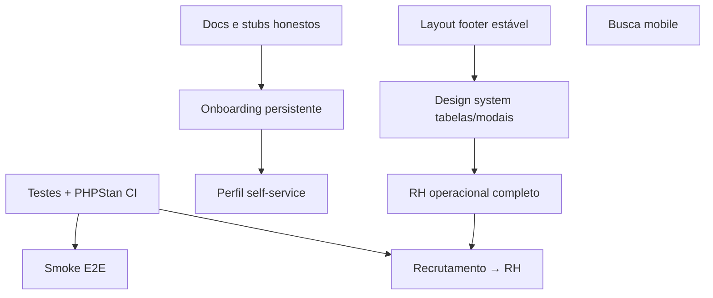

# Roadmap Unio — 30 / 60 / 90 dias

Plano de evolução da plataforma com base no estado atual do repositório (março/2026). Complementa [RH_ROADMAP.md](RH_ROADMAP.md), [QUALIDADE_PERFORMANCE_E_HUBS.md](QUALIDADE_PERFORMANCE_E_HUBS.md) e [ESTRUTURA.md](ESTRUTURA.md).

---

## Visão geral

| Horizonte | Tema | Resultado esperado |
|-----------|------|-------------------|
| **30 dias** | Consolidação | Shell estável, docs corretas, stubs honestos, testes críticos |
| **60 dias** | Experiência diária | Perfil, onboarding persistente, mobile, design system ampliado |
| **90 dias** | Produto maduro | Talentos alinhado, KPIs reais, RH operacional completo, CI forte |

### Princípios

1. **Não prometer o que é stub** — maturidade no menu deve refletir sub-rotas reais (`HubMaturity.php` vs `layout/stub.html.twig`).
2. **Proteger o que já funciona** — RH, Recrutamento, Pessoas e TI antes de abrir núcleos novos.
3. **Melhorias pequenas e verificáveis** — cada item abaixo tem critério de “feito”.

---

## Fase 1 — 30 dias: Consolidação

Objetivo: eliminar confusão para usuários e devs; reduzir regressões.

### Semana 1–2: Verdade do produto

| ID | Item | Módulo | Arquivos / notas | Critério de feito |
|----|------|--------|------------------|-------------------|
| P1-01 | Atualizar `docs/RH.md` (portal e ATS existem) | Docs | `docs/RH.md` | Doc alinhada com `RhPortalController`, hub Recrutamento |
| P1-02 | Alinhar README Docker (Redis/Mercure) | Infra | `README.md`, `docker-compose.yml` | Compose local sobe serviços documentados ou README corrige expectativa |
| P1-03 | Badges de maturidade no apps launcher | Shell | `HubMaturity.php`, `platform_apps_launcher.html.twig` | Preview/MVP visível; Talentos/Maturidade honestos se sub-rotas são stub |
| P1-04 | Esconder ou redirecionar stubs Engenharia/Publicidade | Hubs | `templates/modules/{engenharia,publicidade}/*`, sidebar | Usuário não cai em dead-end sem contexto |
| P1-05 | Unificar Talentos → Recrutamento (decisão) | Produto | `talentos/index.html.twig`, rotas | KPIs linkam vagas reais **ou** hub marcado Preview com redirect |

### Semana 3–4: Qualidade e layout

| ID | Item | Módulo | Arquivos / notas | Critério de feito |
|----|------|--------|------------------|-------------------|
| P1-06 | PHPStan no CI | CI | `.github/workflows/ci.yml` | Pipeline falha se análise estática falhar |
| P1-07 | Testes HTTP de grants | Segurança | `ProductGrantSubscriber`, `tests/Security/` | Usuário sem grant: redirect + rota ausente no menu |
| P1-08 | Testes controller RH (smoke) | RH | `RhController`, `RhFeriasController` | 3+ testes: listagem, 403 sem grant, fluxo básico |
| P1-09 | Testes controller Recrutamento (smoke) | Recrutamento | `RecrutamentoController.php` | Pipeline + vagas acessíveis com grant |
| P1-10 | Footer/layout: regressão em páginas longas | Shell | `unio-app.css`, `page-body-fill` | Dashboard e Welcome: footer só no fim do scroll |
| P1-11 | Fluxos no Hub de Ajuda (RH + Recrutamento) | Shell | `OnboardingTourService.php`, `shell_help_hub.html.twig` | 2+ fluxos novos documentados no painel |

### Entregáveis fase 1

- [x] Documentação não contradiz código (`RH.md`, `README.md`)
- [x] CI com PHPUnit + PHPStan + `composer validate:system`
- [x] Badges Preview/MVP no apps launcher; Talentos → Recrutamento
- [x] Footer/layout em páginas longas (dashboard)
- [x] Testes HTTP grants + smoke RH
- [x] Fluxos Hub Ajuda RH + Recrutamento
- [x] Esconder stubs Engenharia/Publicidade no menu (P1-04)
- [x] Smoke tests Recrutamento (P1-09)

---

## Fase 2 — 60 dias: Experiência diária

Objetivo: o usuário consegue trabalhar bem no mobile e na primeira semana.

### Semana 5–6: Identidade e primeiro acesso

| ID | Item | Módulo | Arquivos / notas | Critério de feito |
|----|------|--------|------------------|-------------------|
| P2-01 | Onboarding persistente (DB) | Core | `OnboardingProgressService.php`, migration User/onboarding | Progresso sobrevive logout/dispositivo |
| P2-02 | Perfil: troca de senha | Core | `profile/index.html.twig`, controller | Form funcional com validação Symfony |
| P2-03 | Perfil: editar nome/foto | Core | `User` entity, upload avatar | Salva e reflete no header |
| P2-04 | Sasha: mensagens consistentes | Shell | `helix_assistant.html.twig`, `base.html.twig` | Sem “Em breve” se chat API ativa |
| P2-05 | Extrair JS Helix do base | Shell | `public/js/unio-helix-panel.js` | `base.html.twig` sem bloco JS grande |

### Semana 7–8: Mobile e design system

| ID | Item | Módulo | Arquivos / notas | Critério de feito |
|----|------|--------|------------------|-------------------|
| P2-06 | Busca global no mobile | Shell | `base.html.twig`, `global_search` | Atalho ou ícone lupa visível em `< md` |
| P2-07 | Design system: tabelas | DS | `unio-app.css`, `/dev/components` | Padrão list/table documentado e aplicado em 1 listagem |
| P2-08 | Design system: modais e offcanvas | DS | `unio-shell-polish.css`, dev/components | Vitrine + tokens de radius/sombra |
| P2-09 | Design system: tabs | DS | hub tabs, admin tabs | Estado ativo/hover unificado |
| P2-10 | KPIs reais no hub Talentos | Talentos | `WelcomeAnalyticsService`, `talentos/index.html.twig` | Números de recrutamento/pessoas, não hardcoded `0` |

### Entregáveis fase 2

- [x] Onboarding retoma de onde parou (P2-01 — persistência no usuário)
- [x] Perfil com self-service mínimo (P2-02 senha + P2-03 nome/foto)
- [ ] Busca acessível no celular
- [ ] `/dev/components` cobre tabela + modal + tabs

---

## Fase 3 — 90 dias: Produto maduro

Objetivo: operação RH completa, analytics úteis, base para novos núcleos.

### Semana 9–10: RH operacional

| ID | Item | Módulo | Arquivos / notas | Critério de feito |
|----|------|--------|------------------|-------------------|
| P3-01 | UI editar admissão em andamento | RH | `RhAdmissoesController`, templates admissão | Editar campos permitidos sem novo cadastro |
| P3-02 | E-mail ao aprovar férias | RH | `RhFeriasService`, Mailer | Colaborador recebe notificação |
| P3-03 | Portal RH no menu principal | RH | sidebar, `RhPortalController` | Link visível para funcionário vinculado |
| P3-04 | Conversão candidato → admissão | RH/Recrutamento | `RhRecrutamentoService::convertToOnboarding` | Fluxo ponta a ponta testado |
| P3-05 | eSocial: processar fila (MVP+) | RH | `RhEsocialService`, command | Job documentado + teste de integração |

### Semana 11–12: Analytics, performance, extensão

| ID | Item | Módulo | Arquivos / notas | Critério de feito |
|----|------|--------|------------------|-------------------|
| P3-06 | Dashboard analytics por grant | Core | `dashboard/index.html.twig`, services Analytics | Gráficos só do que o usuário pode ver |
| P3-07 | Hub Maturidade: 1 sub-módulo real | Maturidade | escolher 1 rota stub → MVP | Substituir stub por listagem mínima |
| P3-08 | Fontes self-hosted (Inter/Sora) | Performance | `vendor_styles`, `npm run vendor:sync` | Sem request blocking para Google Fonts |
| P3-09 | Smoke E2E (BrowserKit) | QA | `tests/Functional/` | Login → dashboard → RH → recrutamento |
| P3-10 | Refatorar `PermissionService` (fase 1) | Arquitetura | extrair `SidebarHubBuilder` | Arquivo < 800 linhas; testes do builder |

### Entregáveis fase 3

- [ ] RH cobre ciclo admissão → férias → portal
- [ ] Recrutamento integrado ao RH
- [ ] Suite smoke impede regressão de rotas Twig
- [ ] Performance perceptível (fontes + cache local documentado)

---

## Backlog por módulo

Legenda: **P0** bloqueante · **P1** alto · **P2** médio · **P3** nice-to-have

### Shell / Core

| ID | Prioridade | Item | Esforço |
|----|------------|------|---------|
| SH-01 | P1 | Tour: fluxos por módulo (Pessoas, TI) | M |
| SH-02 | P1 | Notificações: agrupamento e mark-as-read em lote | S |
| SH-03 | P2 | Atalhos teclado documentados no Hub Ajuda | S |
| SH-04 | P2 | Tema: preferência sincronizada server-side | M |
| SH-05 | P3 | Reduzir `?v=` manual — Asset Mapper versioning | L |

### RH

| ID | Prioridade | Item | Esforço |
|----|------------|------|---------|
| RH-01 | P1 | Editar admissão (UI) | M |
| RH-02 | P1 | E-mail férias aprovadas | S |
| RH-03 | P1 | Testes controller folha/férias | M |
| RH-04 | P2 | Folha legal — motor rubricas v1 | L |
| RH-05 | P2 | Assinatura digital — integração provedor | L |
| RH-06 | P3 | Analytics RH — gráficos evolução headcount | M |

*Detalhe fases RH:* [RH_ROADMAP.md](RH_ROADMAP.md)

### Recrutamento

| ID | Prioridade | Item | Esforço |
|----|------------|------|---------|
| RC-01 | P1 | Testes HTTP pipeline + candidatos | M |
| RC-02 | P1 | Analytics export CSV | S |
| RC-03 | P2 | Carreiras — página pública polish | M |
| RC-04 | P2 | Duplicar vaga / template vaga | S |
| RC-05 | P3 | SLA por etapa do pipeline | M |

### Pessoas

| ID | Prioridade | Item | Esforço |
|----|------------|------|---------|
| PS-01 | P1 | Organograma interativo (zoom/pan) | M |
| PS-02 | P2 | Ficha: competências CRUD | M |
| PS-03 | P2 | Avaliação 9-box MVP | L |
| PS-04 | P3 | Import CSV membros | M |

### Talentos / Maturidade

| ID | Prioridade | Item | Esforço |
|----|------------|------|---------|
| TL-01 | P0 | Decisão produto: merge com Recrutamento ou MVP banco talentos | M |
| TL-02 | P1 | Ajustar `HubMaturity` se sub-rotas stub | S |
| MT-01 | P2 | Implementar 1 trilha/certificação listagem | L |
| MT-02 | P3 | Matriz competências × cargo | L |

### TI

| ID | Prioridade | Item | Esforço |
|----|------------|------|---------|
| TI-01 | P2 | War Room — testes controller | M |
| TI-02 | P2 | KB full-text search | M |
| TI-03 | P3 | SLA dashboard por equipe | M |

### Pós-Operatório

| ID | Prioridade | Item | Esforço |
|----|------------|------|---------|
| PO-01 | P1 | Testes alertas + triagem | M |
| PO-02 | P2 | Mercure local no compose | S |
| PO-03 | P2 | Portal paciente — PWA offline básico | M |

### Integrações / Inovação

| ID | Prioridade | Item | Esforço |
|----|------------|------|---------|
| IN-01 | P2 | OpenAPI docs Integrações | M |
| IN-02 | P3 | Dead letter — replay UI | M |
| IV-01 | P3 | OKR pulse — notificações | S |

### Segurança / Permissões

| ID | Prioridade | Item | Esforço |
|----|------------|------|---------|
| SG-01 | P1 | Log acesso negado (audit) | S |
| SG-02 | P1 | Forms Symfony em rotas POST críticas | L |
| SG-03 | P2 | 2FA roadmap + UI placeholder honesto | L |
| SG-04 | P2 | Split `PermissionService` | L |

### Qualidade / DevEx

| ID | Prioridade | Item | Esforço |
|----|------------|------|---------|
| QX-01 | P1 | PHPStan no CI | S |
| QX-02 | P1 | Cobertura mínima Security + Rh (threshold) | M |
| QX-03 | P2 | Reduzir baseline PHPStan (-20 entradas) | M |
| QX-04 | P2 | ESLint + teste mínimo shell JS | M |
| QX-05 | P3 | Puppeteer smoke visual (dashboard) | L |

**Esforço:** S ≈ 1–3 dias · M ≈ 1 semana · L ≈ 2+ semanas

---

## Dependências entre fases

---

## Métricas de sucesso (90 dias)

| Métrica | Baseline | Meta |
|---------|----------|------|
| Testes PHPUnit | ~33 arquivos | 50+ (controllers RH/Recrutamento) |
| PHPStan no CI | Não | Sim, baseline não cresce |
| Páginas stub expostas sem badge | ~19 | 0 (badge Preview ou ocultas) |
| Onboarding completado (persistido) | Session only | % usuários com progresso salvo |
| Tempo até 1ª ação útil (novo usuário) | — | −30% com tour + checklist persistente |
| Regressões layout footer | 1+ reportadas | 0 em dashboard/listas |

---

## O que já está forte (não replanejar)

- Shell inset, tema claro/escuro, `page-body-fill`, empty states
- Hub de Ajuda + tour sob demanda (`OnboardingTourService`, `unio-shell-tour.js`)
- Hub Recrutamento operacional (vagas, pipeline, candidatos, analytics)
- Grants granulares (`ProductGrantAccess`, `ProductGrantRouteMap`)
- Sasha AI (`SashaApiController`, serviço Python)
- Galeria `/dev/components`
- CI: PHPUnit + MariaDB + `validate:system`

---

## Como usar este documento

1. **Sprint planning** — puxar itens P1-XX / P2-XX da fase corrente.
2. **Issues GitHub** — copiar ID (ex. `P1-06`, `RH-01`) como prefixo do título.
3. **Revisão quinzenal** — marcar entregáveis e mover itens entre fases.
4. **RH específico** — cruzar com [RH_ROADMAP.md](RH_ROADMAP.md) fases 2–3.

---

## Próxima revisão sugerida

**Data:** início do mês +30 dias · **Responsável:** tech lead + produto · **Entrada:** feedback usuários, métricas CI, itens concluídos deste doc.
