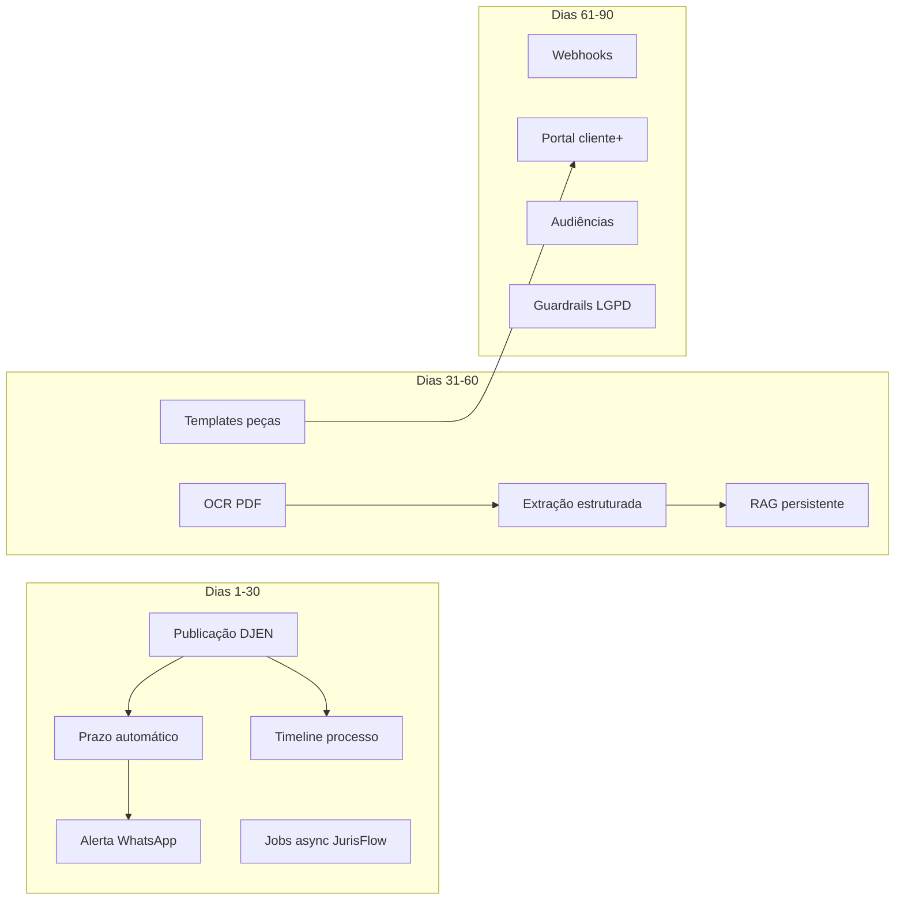

# Roadmap Unio Jurídico + JurisFlow — 90 dias

Plano de evolução **Unio Jurídico** (Symfony) + **JurisFlow API Service** (Python), com base no estado do repositório em **agosto/2026**.

Complementa [JURISFLOW_START.md](JURISFLOW_START.md), [ROADMAP_90_DIAS.md](ROADMAP_90_DIAS.md) (plataforma geral) e o catálogo em `src/Config/JuridicoModuleRegistry.php`.

---

## Baseline (o que já existe)

### Plataforma (beta/alpha em produção)

| Área | Status | Código de referência |
|------|--------|----------------------|
| Processos, tarefas, partes, Kanban | beta | `JuridicoProcesso*`, `processo_show.html.twig` |
| Prazos + alertas WhatsApp/e-mail | beta | `JuridicoPrazo*`, `JuridicoPrazoAlertaCommand` |
| Publicações DJEN + triagem IA | beta | `JuridicoPublicacao*`, `JuridicoCapturarPublicacoesCommand` |
| GED + sync RAG (TF-IDF) | beta | `JuridicoDocumento*`, `JuridicoDocumentoRagSyncService` |
| Portal do cliente (convite) | beta | `JuridicoPortalController` |
| Honorários + cobrança + Analytics | beta | `JuridicoHonorario*`, `JuridicoCobranca*`, `JuridicoAnalyticsService` |
| Jurisprudência IA | beta | `JuridicoJurisprudencia*`, chain `jurisprudence-search` |
| DataJud (andamentos) | alpha | `DataJudClient`, `JuridicoTribunaisController` |
| Previsão de êxito | alpha | `PrevisaoExitoService`, `PreverExitoTool` |
| Agente Autônomo 24/7 | beta | `AgenteAutonomoJuridicoCommand` |
| Orquestração IA / Modo Lex | beta | `JurisFlowAiClient`, 18 tools em `Tool/Juridico/` |
| API pública v1 | beta | `PublicApiController` — processos, prazos, tarefas, jurisprudência |
| API interna (JurisFlow → Symfony) | beta | `AiInternalApiController` |

### JurisFlow API (produção HostGator :8098)

| Recurso | Endpoint |
|---------|----------|
| Health / status / usage | `GET /health`, `/v1/status`, `/v1/usage` |
| Chat Sasha | `POST /v1/assistant/Sasha/chat` |
| Chains (8) | `/v1/chains/*` — summarize, contract-analysis, document-generation, sentence-analysis, document-comparison, jurisprudence-search, … |
| RAG por escritório | `POST /v1/rag/{escritorio_id}/documents`, `POST …/search` |
| Agents | habilitados no status (`Agents: enabled`) |

### Lacunas principais (gaps)

1. **Pipeline pub → prazo → alerta** existe em partes, mas falta auditoria, idempotência e painel de falhas.
2. **Linha do tempo unificada** do processo (movimentações + publicações + prazos + docs + WhatsApp) — não existe.
3. **RAG em memória** — some no restart do uvicorn; sem embeddings persistentes.
4. **OCR / extração estruturada** de PDF — só `DocumentTextExtractorService` básico no Symfony.
5. **Jobs assíncronos** — tudo síncrono; HostGator LVE penaliza documentos grandes.
6. **Templates de peças** com variáveis e aprovação — geração livre via chain, sem governança.
7. **Webhooks** na API pública — não há eventos push.
8. **Audiências, assinatura, conflito de interesses** — `planned` no registry.

---

## Visão dos 90 dias

| Horizonte | Tema | Resultado |
|-----------|------|-----------|
| **Dias 1–30** | Fechar o ciclo operacional | Pub → prazo → alerta confiável + timeline do processo + jobs assíncronos |
| **Dias 31–60** | Inteligência documental | OCR, extração CNJ/partes, RAG persistente, templates e precedentes internos |
| **Dias 61–90** | Produto escalável | Portal cliente, webhooks, audiências MVP, guardrails e evals |



---

## Fase 1 — Dias 1–30: Ciclo operacional fechado

Objetivo: o escritório **confia** que publicação vira prazo e alerta sem intervenção manual.

### Épico J1 — Pipeline publicação → prazo → alerta (P0)

| ID | Entrega | Onde |
|----|---------|------|
| J1-01 | Tabela de auditoria do pipeline | Migration: `juridico_publicacao_evento` |
| J1-02 | Serviço orquestrador idempotente | `JuridicoPublicacaoPipelineService` |
| J1-03 | Abrir prazo só 1x por publicação | flag `prazo_gerado_em` em `JuridicoPublicacao` |
| J1-04 | Retry de triagem falha (fila) | `JuridicoRetriagemPublicacoesCommand` |
| J1-05 | Painel “falhas do pipeline” | aba em `publicacoes_list.html.twig` |
| J1-06 | Métricas no Analytics | publicações triadas, prazos auto, falhas |

**Entidades / migration**

```sql
-- juridico_publicacao_evento
id, publicacao_id, tipo ENUM(triagem|match|prazo|alerta|erro),
payload JSON, criado_em

-- juridico_publicacao (colunas novas)
prazo_gerado_em DATETIME NULL,
pipeline_status VARCHAR(32) DEFAULT 'pendente'
```

**JurisFlow (opcional neste épico)**

- `POST /v1/chains/publication-triage` — resposta JSON estruturada (não parse de texto livre)
- Schema: `{ classificacao, resumo, acao, prazo_dias, tipo_prazo, confianca }`

**Critério de feito**

- [ ] Publicação com processo vinculado → prazo criado automaticamente em &lt; 2 min
- [ ] Reprocessar a mesma publicação **não** duplica prazo
- [ ] Falha de IA registrada em `juridico_publicacao_evento` + visível na UI
- [ ] Alerta WhatsApp dispara após prazo criado (quando configurado)

---

### Épico J2 — Timeline unificada do processo (P0)

| ID | Entrega | Onde |
|----|---------|------|
| J2-01 | Agregador de eventos | `JuridicoProcessoTimelineService` |
| J2-02 | Tipos de evento normalizados | enum: movimentacao, publicacao, prazo, tarefa, documento, mensagem, honorario |
| J2-03 | Aba “Linha do tempo” | `processo_show.html.twig` (nova tab) |
| J2-04 | Import DataJud → eventos | `JuridicoTribunalSyncService` grava em timeline |
| J2-05 | Contexto para Sasha | `numero_processo_atual` + últimos 10 eventos no chat |

**Entidades**

```sql
-- juridico_processo_evento (opcional: view materializada ou tabela)
id, processo_id, tipo, titulo, resumo, referencia_tipo, referencia_id,
ocorreu_em, criado_em, metadata JSON
```

**API**

- `GET /api/v1/publica/processos/{numero}/timeline` (novo endpoint público)
- `GET /api/v1/interno/timeline?escritorio_id=&numero=` (agent tools)

**Nova tool Sasha**

- `BuscarTimelineProcessoTool` → `AiInternalApiController::timeline`

**Critério de feito**

- [ ] Aba timeline mostra últimos 50 eventos ordenados
- [ ] Publicação triada aparece na timeline em até 1 min
- [ ] Sasha responde “o que aconteceu neste processo?” usando eventos reais

---

### Épico J3 — Jobs assíncronos no JurisFlow (P0)

| ID | Entrega | Onde |
|----|---------|------|
| J3-01 | Modelo de job | `app/jobs/` no JurisFlow |
| J3-02 | Store de jobs (SQLite ou arquivo) | `data/jobs.db` por escritório |
| J3-03 | Endpoints | ver tabela abaixo |
| J3-04 | Cliente Symfony | `JurisFlowAiClient::submitJob()`, `getJob()` |
| J3-05 | UI “processando…” | upload GED, triagem em lote, minuta longa |

**Endpoints JurisFlow**

```
POST /v1/jobs
  body: { type, escritorio_id, payload }
  → { job_id, status: "queued" }

GET  /v1/jobs/{job_id}
  → { status, progress, result?, error? }

POST /v1/jobs/analyze-document   (atalho)
POST /v1/jobs/triage-publication (atalho)
POST /v1/jobs/index-rag          (atalho)
```

**Tipos de job iniciais**

| type | Uso |
|------|-----|
| `document.analyze` | resumo + extração |
| `publication.triage` | triagem estruturada |
| `rag.reindex` | reindexar escritório |
| `document.compare` | comparação longa |

**Critério de feito**

- [ ] Upload PDF &gt; 20 páginas não estoura timeout HTTP do Symfony
- [ ] Job persiste após restart do uvicorn (store em disco)
- [ ] Symfony faz polling ou webhook (J4) ao concluir

---

### Épico J4 — Webhook Symfony ← JurisFlow (P1)

| ID | Entrega | Onde |
|----|---------|------|
| J4-01 | Endpoint receptor | `POST /api/v1/interno/jurisflow/webhook` |
| J4-02 | Assinatura HMAC | header `X-JurisFlow-Signature` |
| J4-03 | Eventos | `job.completed`, `job.failed` |
| J4-04 | Atualiza publicação/doc após job | listeners no pipeline |

**Critério de feito**

- [ ] Job de triagem concluído atualiza `JuridicoPublicacao` sem polling manual

---

### Épico J5 — Tools do agent (completar lacunas) (P1)

| Tool nova | Ação |
|-----------|------|
| `TriarPublicacaoTool` | triagem + aplicar resultado |
| `AbrirPrazoPublicacaoTool` | prazo a partir da pub (com confirmação) |
| `BuscarPublicacoesTool` | lista pubs do processo |
| `IndexarDocumentoTool` | dispara sync RAG |

**Arquivos**: `src/Service/Sasha/Tool/Juridico/*` + rotas em `AiInternalApiController`

---

## Fase 2 — Dias 31–60: Inteligência documental

Objetivo: documentos viram **dados estruturados** e **precedentes reutilizáveis**.

### Épico J6 — OCR + extração estruturada (P0)

| ID | Entrega | JurisFlow |
|----|---------|-----------|
| J6-01 | Pipeline ingestão | `POST /v1/ingest/document` (multipart PDF) |
| J6-02 | OCR | PyMuPDF + fallback Tesseract (pt-BR) |
| J6-03 | Extração CNJ, partes, datas, valor | `POST /v1/extract/process-metadata` |
| J6-04 | Classificador tipo doc | petição, sentença, contrato, procuração (sem LLM ou mini-modelo) |
| J6-05 | Bridge Symfony | `JuridicoDocumentoIngestService` chama ingest no upload |

**Resposta exemplo**

```json
{
  "text": "...",
  "pages": 12,
  "metadata": {
    "numero_cnj": "0000000-00.0000.0.00.0000",
    "partes": [{"nome": "...", "polo": "autor"}],
    "valor_causa": 120000.00,
    "tipo_documento": "peticao_inicial"
  },
  "ocr_confidence": 0.94
}
```

**Symfony**

- Colunas em `juridico_documento`: `texto_extraido`, `ocr_em`, `metadata_json`
- Botão “Extrair dados” em `documentos_list.html.twig`

**Critério de feito**

- [ ] PDF escaneado vira texto pesquisável
- [ ] Número CNJ detectado com &gt; 90% em docs de teste internos
- [ ] Metadados pré-preenchem cadastro de processo (sugestão, não auto-save)

---

### Épico J7 — RAG persistente + embeddings (P0)

| ID | Entrega | Onde |
|----|---------|------|
| J7-01 | Vector store em disco | FAISS ou sqlite-vss em `data/rag/{escritorio_id}/` |
| J7-02 | Embeddings | `sentence-transformers` multilíngue leve ou Azure embeddings |
| J7-03 | Chunking jurídico | por seção (fatos, direito, pedidos, dispositivo) |
| J7-04 | Rerank | cross-encoder ou score híbrido TF-IDF + vetor |
| J7-05 | Citação com offset | `chunks[].source_span` para highlight na UI |
| J7-06 | Sync incremental | hash SHA-256 do conteúdo (`JuridicoDocumentoRagSyncService` já tem base) |

**Endpoints**

```
POST /v1/rag/{escritorio_id}/documents     (existente — evoluir)
POST /v1/rag/{escritorio_id}/search        (existente — rerank)
POST /v1/rag/{escritorio_id}/reindex       (job async)
GET  /v1/rag/{escritorio_id}/stats
```

**Critério de feito**

- [ ] Restart do uvicorn **não** apaga índice
- [ ] `SugerirPecasSimilaresTool` retorna trechos com score &gt; limiar
- [ ] Busca “contestação horas extras” encontra peça interna relevante

---

### Épico J8 — Biblioteca de templates de peças (P1)

| ID | Entrega | Symfony |
|----|---------|---------|
| J8-01 | Entidade template | `JuridicoTemplatePeca` |
| J8-02 | Variáveis `{{cliente}}`, `{{processo.numero}}`, … | `JuridicoTemplateRenderer` |
| J8-03 | Versão + status (rascunho, aprovado) | workflow simples |
| J8-04 | Tela CRUD | `JuridicoTemplateController`, `templates_pecas_list.html.twig` |
| J8-05 | Gerar minuta | chain `document-generation` + template base |

**Migration**

```sql
juridico_template_peca (
  id, empresa_id, nome, tipo, area, corpo TEXT,
  variaveis JSON, status, versao, aprovado_por_id, criado_em
)
```

**Integração Sasha**

- `GerarMinutaTool` aceita `template_id` opcional

**Critério de feito**

- [ ] Sócio aprova template antes de aparecer para estagiários
- [ ] Minuta gerada preenche variáveis do processo ativo

---

### Épico J9 — Precedentes internos do escritório (P1)

| ID | Entrega | Onde |
|----|---------|------|
| J9-01 | Marcar documento como “precedente” | flag em `JuridicoDocumento` |
| J9-02 | Categoria: ganhou / perdeu / acordo | enum `resultado_precedente` |
| J9-03 | Busca “casos parecidos” | chain ou RAG filtrado por `category=precedente` |
| J9-04 | Widget no processo | card “Peças similares do escritório” em `processo_show` |

---

## Fase 3 — Dias 61–90: Produto escalável

Objetivo: integrações externas, portal maduro e compliance.

### Épico J10 — Portal do cliente v2 (P1)

| ID | Entrega | Onde |
|----|---------|------|
| J10-01 | Timeline read-only por processo | `JuridicoPortalService` filtra eventos públicos |
| J10-02 | Upload documento pelo cliente | `POST /juridico/portal/upload` |
| J10-03 | Aprovar minuta (aceite digital simples) | `JuridicoPortalAprovacao` |
| J10-04 | Notificação ao advogado | Pulso + e-mail |

**Entidades**

```sql
juridico_portal_upload (id, cliente_id, processo_id, documento_id, status)
juridico_portal_aprovacao (id, documento_id, cliente_id, aceito_em, ip)
```

---

### Épico J11 — Webhooks API pública (P1)

| ID | Entrega | Onde |
|----|---------|------|
| J11-01 | Entidade subscription | `JuridicoWebhookSubscription` |
| J11-02 | CRUD na tela API pública | `api_publica.html.twig` |
| J11-03 | Dispatcher | `JuridicoWebhookDispatcher` + retry 3x |
| J11-04 | Eventos iniciais | ver tabela |

**Eventos**

| evento | quando |
|--------|--------|
| `processo.atualizado` | CRUD processo |
| `prazo.criado` | novo prazo |
| `prazo.vencendo` | cron D-1 |
| `publicacao.nova` | captura DJEN |
| `documento.indexado` | RAG sync OK |

**Endpoint gestão**

```
POST   /api/v1/publica/webhooks
GET    /api/v1/publica/webhooks
DELETE /api/v1/publica/webhooks/{id}
```

---

### Épico J12 — Audiências MVP (P2)

| ID | Entrega | Symfony |
|----|---------|---------|
| J12-01 | Entidade | `JuridicoAudiencia` |
| J12-02 | CRUD + calendário | `JuridicoAudienciaController` |
| J12-03 | Checklist preparação | JSON em `checklist` |
| J12-04 | Roteiro Sasha | chain `hearing-prep` no JurisFlow |
| J12-05 | Conflito de agenda | alerta se mesmo advogado em 2 audiências |

**JurisFlow**

```
POST /v1/chains/hearing-prep
  { tipo_audiencia, area, resumo_caso, testemunhas[] }
```

**Tela**: `audiencias_list.html.twig` (novo módulo, status beta no registry)

---

### Épico J13 — Conflito de interesses (P2)

| ID | Entrega | Onde |
|----|---------|------|
| J13-01 | Scan ao cadastrar processo/cliente | `JuridicoConflitoService` |
| J13-02 | Cruza partes adversárias | `JuridicoProcessoParte` × carteira |
| J13-03 | Fuzzy match de nomes | LLM leve ou similaridade string |
| J13-04 | Relatório + bloqueio opcional | config por escritório |

---

### Épico J14 — Guardrails LGPD / OAB (P1)

| ID | Entrega | JurisFlow middleware |
|----|---------|---------------------|
| J14-01 | Redação PII antes do LLM | CPF, RG, OAB, e-mail, telefone |
| J14-02 | Política por escritório | `retention_days`, `allow_external_llm` |
| J14-03 | Checagem ética OAB | lista de padrões proibidos na resposta |
| J14-04 | Audit log | `data/audit/{escritorio_id}/YYYY-MM.jsonl` |

**Endpoint**

```
GET /v1/compliance/status?escritorio_id=
POST /v1/compliance/redact  (teste)
```

---

### Épico J15 — Evals e observabilidade (P1)

| ID | Entrega | Onde |
|----|---------|------|
| J15-01 | Dataset anonimizado | `tests/evals/juridico/*.jsonl` no JurisFlow |
| J15-02 | Métricas por chain | acurácia triagem, prazo sugerido vs humano |
| J15-03 | Dashboard uso | expandir `/v1/usage` + tela admin Symfony |
| J15-04 | Routing de modelo | triagem = mini, minuta = superior/Lex |

**Symfony**

- `JuridicoAiOpsController` — painel interno (só admin): latência, custo, falhas

---

### Épico J16 — Assinatura eletrônica (P2, preparação)

| ID | Entrega | Notas |
|----|---------|-------|
| J16-01 | Adapter interface | `AssinaturaEletronicaProviderInterface` |
| J16-02 | Provider Clicksign ou ZapSign | env `ASSINATURA_PROVIDER` |
| J16-03 | Fluxo minuta → revisão → assinatura | integra com J8 templates |
| J16-04 | Webhook assinatura concluída | atualiza `JuridicoDocumento.status` |

Sem implementar provedor completo nos 90 dias — apenas contrato + 1 provider sandbox.

---

## Matriz de prioridade (resumo executivo)

| Prioridade | Épicos | Semanas |
|------------|--------|---------|
| **P0** | J1 Pipeline pub→prazo, J2 Timeline, J3 Jobs async, J6 OCR, J7 RAG persistente | 1–8 |
| **P1** | J4 Webhook, J5 Tools, J8 Templates, J9 Precedentes, J10 Portal v2, J11 Webhooks API, J14 Guardrails, J15 Evals | 5–12 |
| **P2** | J12 Audiências, J13 Conflito, J16 Assinatura | 9–13 |

---

## Ordem sugerida de sprints (2 semanas cada)

| Sprint | Foco | Entregáveis |
|--------|------|-------------|
| S1 | J1 pipeline | auditoria, idempotência, painel falhas |
| S2 | J2 timeline | aba processo + API interna |
| S3 | J3 + J4 jobs | async JurisFlow + webhook Symfony |
| S4 | J5 tools | 4 tools novas + router |
| S5 | J6 OCR | ingest + extração CNJ |
| S6 | J7 RAG | FAISS persistente + rerank |
| S7 | J8 + J9 | templates + precedentes |
| S8 | J10 portal | upload cliente + timeline pública |
| S9 | J11 webhooks | API pública eventos |
| S10 | J14 + J15 | guardrails + evals |
| S11–12 | J12–J13–J16 | audiências, conflito, stub assinatura |

---

## Infra e decisões técnicas

### HostGator vs Azure

| Componente | HostGator | Azure Container Apps |
|------------|-----------|----------------------|
| Chat / chains leves | OK com keepalive | Preferível longo prazo |
| Jobs pesados (OCR, reindex) | Job store em disco + fila | **Recomendado** para J6/J7 |
| RAG vector store | Disco local (`data/rag/`) | Blob + índice |

**Recomendação**: manter **gateway** no HostGator (Symfony) e migrar **workers** JurisFlow para Azure quando J3 estiver estável.

### Novas variáveis de ambiente

**Symfony (`.env.local`)**

```bash
LEGAL_AI_WEBHOOK_SECRET=...
LEGAL_AI_JOB_POLL_MS=2000
JURIDICO_PIPELINE_AUTO_PRAZO=true
JURIDICO_WEBHOOKS_ENABLED=true
```

**JurisFlow**

```bash
JOB_STORE_PATH=./data/jobs
RAG_STORE_PATH=./data/rag
WEBHOOK_URL=https://uniojuridico.uniowork.com.br/api/v1/interno/jurisflow/webhook
PII_REDACTION=true
```

---

## Critérios de sucesso dos 90 dias

1. **Operação**: 95% das publicações com processo vinculado geram prazo sem intervenção manual.
2. **Confiança**: timeline do processo é a fonte única de “o que aconteceu”.
3. **Documentos**: PDF escaneado indexado e buscável em &lt; 5 min (job async).
4. **IA**: RAG sobrevive restart; citações apontam trecho real do GED.
5. **Integração**: 1 parceiro externo consome webhook `prazo.vencendo`.
6. **Compliance**: PII redigido antes de enviar ao Azure OpenAI (log auditável).

---

## Próximo passo imediato

Começar pelo **Épico J1** (pipeline) + **J2** (timeline) em paralelo:

1. Migration `juridico_publicacao_evento` + colunas pipeline.
2. `JuridicoPublicacaoPipelineService` unificando triagem → match → prazo → alerta.
3. Tab timeline em `processo_show.html.twig`.

Isso entrega valor visível na primeira semana sem depender de migração para Azure.
