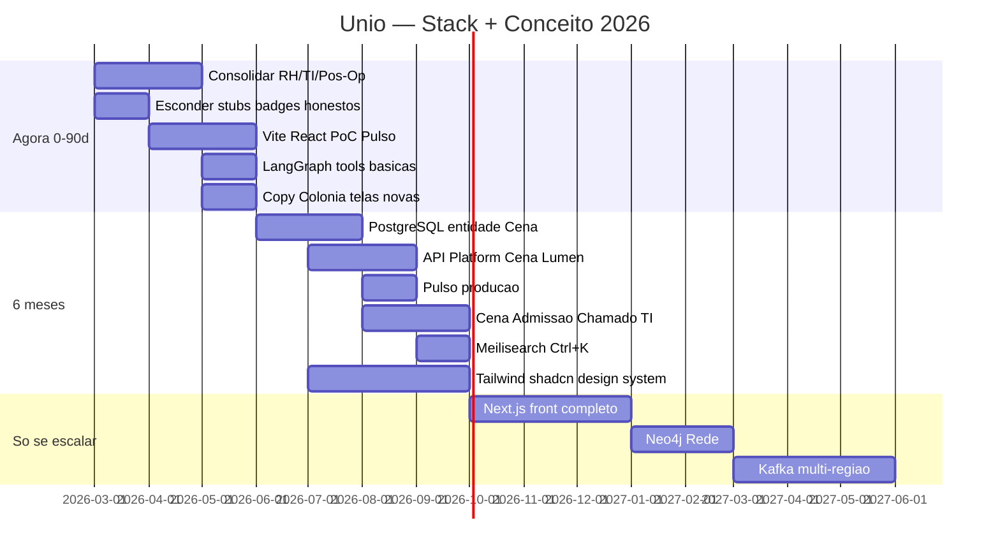

# Roadmap de transição — Unio Organismo

Plano de evolução da plataforma do modelo **Hub / Núcleo / Tenant** para o modelo **Colônia / Cena / Pulso / Lumen**, com matriz de tecnologias e tasks de código concretas.

Complementa [ROADMAP_90_DIAS.md](ROADMAP_90_DIAS.md) (consolidação do produto atual) e [ESTRUTURA.md](ESTRUTURA.md) (organização do código).

**Última revisão:** jul/2026 · **Próxima revisão sugerida:** início do mês +30 dias

---

## Visão geral

| Horizonte | Tema | Resultado esperado |
|-----------|------|-------------------|
| **Agora (0–90 dias)** | Sementes | RH/TI/Pós-Op intactos; PoC Pulso; Lumen com tools; copy Colônia na UI |
| **6 meses (4–6)** | Novo ambiente | PostgreSQL + Cena + API; Pulso produção; hub picker removido |
| **Só se escalar** | Gatilho técnico/comercial | Next full, Neo4j, collab, multi-região |

### Princípios

1. **Nunca remover navegação antiga antes da nova estar melhor** — regra de ouro.
2. **Proteger o que funciona** — RH, Recrutamento, Pessoas, TI, Pós-Op antes de refatorar shell.
3. **Código pode manter nomes legados** — UI fala Colônia/Cena; `Empresa`/`hub_*` migram depois.
4. **Nada de catálogo de promessas** — stubs continuam escondidos (ver P1-03/P1-04 em ROADMAP_90_DIAS).

---

## Glossário (novo ↔ legado)

| Novo (UI / produto) | Legado (código) | Significado |
|---------------------|-----------------|-------------|
| **Colônia** | `Empresa`, workspace | Unidade viva de operação (clínica, filial, obra) |
| **Orquestrador** | `TENANT`, `PLATFORM_OWNER` | Operador SaaS com múltiplas colônias |
| **Cena** | *(novo)* | Momento de trabalho transversal (admissão, chamado, folha) |
| **Prática** | Hub / Produto / módulo | Capacidade: admitir, acompanhar, fechar folha |
| **Presença** | `UserProductGrant`, escopo | O que a pessoa pode fazer (Ver / Agir / Conduzir / Arquitetar) |
| **Pulso** | Dashboard | Batimento vivo da colônia — o que acontece agora |
| **Lumen** | Vitória / Helix | Assistente — interface de ação, não painel lateral |
| **Rede** | Cortex | Mapa de relações entre cenas, membros e práticas |
| **Eco** | Bate Papo | Conversas ligadas a cenas |
| **Membro** | `Funcionario` | Pessoa dentro da colônia |
| **Círculo** | `Departamento` | Grupo orgânico |
| **Observatório** | Plataforma / Admin | Visão do Orquestrador |

### Modos de presença (ex-perfis)

| Legado | Novo |
|--------|------|
| `MEMBRO` | Observador |
| `SUPERVISOR_*` | Condutor |
| `GESTOR_*` | Arquiteto |
| `TENANT` / `PLATFORM_OWNER` | Orquestrador |

---

## Matriz de tecnologias

**Legenda:** ✅ adotar · 🌱 piloto/PoC · 🔄 migrar · ⚠️ manter sem expandir · ❌ não adotar ainda

| Tecnologia | Agora (0–90d) | Em 6 meses | Só se escalar | Gatilho para subir |
|------------|---------------|------------|---------------|-------------------|
| **Symfony 7 + PHP 8.2** | ✅ Manter core | ✅ API Platform rotas novas | FrankenPHP/RoadRunner | p95 >800ms ou >500 req/s |
| **MySQL** | ✅ Manter | 🔄 → PostgreSQL | — | Início entidade Cena |
| **PostgreSQL + pgvector** | ❌ | ✅ Na migração | RAG pesado | >10k docs indexados |
| **Twig + AdminLTE** | ✅ Telas maduras | ⚠️ Congelar | ❌ Desligar | 80% sessões via Pulso |
| **Vite + React (islands)** | 🌱 PoC Pulso | ✅ Pulso + Cena | Next.js full | Islands limitam (>5 telas) |
| **Next.js 15 + TypeScript** | ❌ | 🌱 Piloto marketing | ✅ Front principal | Time front ≥2 devs |
| **Tailwind + shadcn/ui** | 🌱 Só telas novas | ✅ Design system | — | Substitui referência visual |
| **TypeScript** | 🌱 Front novo | ✅ Obrigatório JS novo | — | JS novo >200 linhas |
| **API Platform / REST** | 🌱 Lumen + Pulso | ✅ API-first práticas | GraphQL | >5 integrações externas |
| **Symfony Messenger** | 🌱 Eventos internos | ✅ Outbox cena | Kafka | >50k eventos/dia |
| **Symfony Workflow** | ❌ | ✅ Estados Cena | — | 1ª Cena em produção |
| **Redis** | ✅ Prod | ✅ Streams pulso | Cluster | >100k msgs/dia |
| **Mercure** | ✅ Manter | ✅ Pulso ao vivo | Ably/Pusher | Mercure gargalo ops |
| **Meilisearch** | ❌ | ✅ Ctrl+K intenção | Algolia | >100k registros |
| **LangGraph (Python)** | 🌱 Tools básicas | ✅ Lumen abre Cenas | Multi-agent | >20 tipos de ação |
| **OpenAI / Claude API** | ✅ vitoria-ai | ✅ Streaming front | Fine-tune | IA >$2k/mês |
| **Neo4j** | ❌ | ❌ | ✅ Rede complexa | >1M arestas |
| **React Flow / Cytoscape** | ❌ | 🌱 MVP Rede | Three.js/R3F | Rede feature vendável |
| **Liveblocks** | ❌ | ❌ | ✅ Collab cena | 2+ editores simultâneos |
| **Docker + GitHub Actions** | ✅ Manter | ✅ + Playwright | K3s/Fly.io | SLA 99.9% |
| **PWA / Expo** | 🌱 PWA básico | ✅ Cenas mobile | App nativo | Mobile >40% tráfego |
| **n8n / Temporal** | ❌ | 🌱 n8n | Temporal.io | Workflows >10 |
| **Sentry + OpenTelemetry** | 🌱 Sentry | ✅ Traces full | Datadog | Ops dedicado |

---

## Matriz de produto e conceito

| Mudança | Agora (0–90d) | Em 6 meses | Só se escalar | Critério de feito |
|---------|---------------|------------|---------------|-------------------|
| Copy Colônia na UI | 🌱 Telas novas + workspace | ✅ Glossário unificado UI | Rename `Empresa`→`Colonia` | Zero “Hub/Núcleo/Tenant” visível |
| Eliminar picker Núcleos | ❌ | ✅ Pulso + busca | — | Pulso = entrada principal |
| Entidade Cena | ❌ | ✅ Admissão + Chamado TI | Templates por vertical | 2 tipos em produção |
| Pulso (ex-Dashboard) | 🌱 PoC React | ✅ Pós-login default | Multi-colônia Orquestrador | Login → Pulso |
| Lumen-first | 🌱 3 tools | ✅ Criar cena via chat | Lumen única entrada | >30% ações via Lumen |
| Presença (ex-Grant) | ✅ Manter grants | 🌱 Alias UI | Ver/Agir/Conduzir/Arquitetar | Mapeamento 1:1 |
| Ciclos (Instante→Ano) | ❌ | 🌱 Filtro Pulso | Nav principal | Organização temporal |
| Rede (ex-Cortex) | ✅ cortex.js | 🌱 Grafo 1 cena | Neo4j | Demo enterprise |
| Esconder stubs | ✅ ROADMAP P1 | ✅ Remover launcher | — | Zero tiles Preview |
| Integrações artéria | ✅ Hub interno | 🌱 Eventos → Cena | n8n cliente | Integração abre cena |

---

## Cronograma integrado



---

# Fase Agora — tasks de código (0–90 dias)

Objetivo: plantar o novo conceito **sem quebrar** módulos maduros. Todas as tasks usam prefixo **T0-XX** (Transição Organismo — fase 0).

Encaixa em paralelo com **Fase 1–3** de [ROADMAP_90_DIAS.md](ROADMAP_90_DIAS.md).

---

## Semana 1–2: Fundação e glossário

| ID | Item | Arquivos / notas | Critério de feito |
|----|------|------------------|-------------------|
| T0-01 | Feature flag `organismo_pulso` | `config/packages/unio_organismo.yaml` (novo), parâmetro `%unio.organismo.pulso_enabled%` | Flag liga/desliga rota `/pulso` sem deploy |
| T0-02 | Serviço de copy UI (Colônia vs legado) | `src/Service/OrganismoCopyService.php` (novo) | Métodos `colonia()`, `orquestrador()`, `pulso()` retornam strings; Twig global via subscriber |
| T0-03 | Twig global `organismo` | `src/EventSubscriber/OrganismoTwigSubscriber.php`, `config/services.yaml` | Templates usam `organismo.colonia` em vez de hardcode |
| T0-04 | ~~Copy Colônia no workspace~~ | Removido — login vai direto ao Pulso | Concluído |
| T0-05 | Copy Colônia no banner | `templates/components/page_banner.html.twig`, `templates/macros/empresa.html.twig` | Subtitle opcional “Colônia” quando `use_empresa_logo` |
| T0-06 | Link experimental Pulso no menu | `src/Service/NavigationService.php`, `templates/layout/_sidebar_nav.html.twig` | Item “Pulso” visível só se flag ativa + perfil gestor+ |

---

## Semana 3–4: API Pulso (backend)

| ID | Item | Arquivos / notas | Critério de feito |
|----|------|------------------|-------------------|
| T0-07 | DTO resposta Pulso | `src/Dto/Organismo/PulsoSnapshot.php` (novo) | Campos: `cenas_ativas`, `cenas_aguardando`, `sinais[]`, `colonia_nome` |
| T0-08 | Serviço agregador Pulso | `src/Service/Organismo/PulsoService.php` (novo) | Reutiliza `DashboardStatsService`, `WelcomeAnalyticsService`; retorna snapshot |
| T0-09 | Cenas mock (PoC) | `src/Service/Organismo/PulsoCenaMockProvider.php` (novo) | 3 cenas fake por colônia: admissão, folha, chamado TI |
| T0-10 | API JSON Pulso | `src/Controller/Api/PulsoApiController.php` — `GET /api/pulso` | 200 + JSON; 403 sem workspace; teste funcional |
| T0-11 | Controller shell Pulso | `src/Controller/Core/PulsoController.php` — `GET /pulso`, name `app_pulso` | Renderiza `core/pulso/index.html.twig`; flag desligada → 404 ou redirect dashboard |
| T0-12 | Template mount React | `templates/core/pulso/index.html.twig` | `<div id="pulso-root" data-api-url="...">` + asset Vite |
| T0-13 | Teste API Pulso | `tests/Functional/PulsoApiTest.php` (novo) | Login gestor → GET `/api/pulso` → assert estrutura JSON |

**Contrato API `/api/pulso` (PoC):**

```json
{
  "colonia": { "id": 1, "nome": "Clínica Exemplo" },
  "pulso": { "nivel": "saudavel", "cenas_ativas": 2, "cenas_aguardando": 5 },
  "cenas": [
    {
      "id": "mock-admissao-1",
      "titulo": "Admissão — Ana Silva",
      "tipo": "admissao",
      "praticas": ["vida_membro", "documentos"],
      "estado": "ativa",
      "dias_aberta": 2,
      "condutor": "João"
    }
  ],
  "sinais": [
    { "tipo": "ferias_pendentes", "valor": 3, "rotulo": "Férias aguardando aprovação" }
  ]
}
```

---

## Semana 5–6: Front PoC (Vite + React island)

| ID | Item | Arquivos / notas | Critério de feito |
|----|------|------------------|-------------------|
| T0-14 | Setup Vite | `vite.config.ts`, `assets/pulso/main.tsx`, `package.json` scripts `dev:pulso`, `build:pulso` | `npm run build:pulso` gera `public/build/pulso/` |
| T0-15 | Dependências front PoC | `package.json`: `react`, `react-dom`, `typescript`, `@vitejs/plugin-react`, `tailwindcss` | Sem AdminLTE no bundle Pulso |
| T0-16 | Componente PulsoApp | `assets/pulso/PulsoApp.tsx` | Fetch `/api/pulso`; cards cena; indicador pulso |
| T0-17 | CSS Pulso (Tailwind) | `assets/pulso/pulso.css`, `tailwind.config.js` | Visual orgânico; dark/light via `data-theme` do base |
| T0-18 | Symfony asset manifest | `config/packages/framework.yaml` ou twig helper para `build/pulso/manifest` | Template carrega JS/CSS com hash |
| T0-19 | Smoke visual | Manual + screenshot em `docs/screenshots/pulso-poc.png` (opcional) | Pulso renderiza 3 cenas mock + sinais |

**Estrutura front proposta:**

```
assets/pulso/
├── main.tsx
├── PulsoApp.tsx
├── components/
│   ├── PulsoHeader.tsx
│   ├── CenaCard.tsx
│   └── SinalVital.tsx
├── pulso.css
└── types.ts
```

---

## Semana 7–8: Lumen tools (Vitória com ação)

| ID | Item | Arquivos / notas | Critério de feito |
|----|------|------------------|-------------------|
| T0-20 | Registry de tools | `src/Service/Vitoria/VitoriaToolRegistry.php` (novo) | Registra tools por nome + descrição + handler |
| T0-21 | Tool: buscar membro | `src/Service/Vitoria/Tool/BuscarMembroTool.php` | Input: nome/CPF parcial; output: lista `Funcionario` da colônia |
| T0-22 | Tool: férias pendentes | `src/Service/Vitoria/Tool/FeriasPendentesTool.php` | Reutiliza repo RH; count + links rotas |
| T0-23 | Tool: abrir admissão | `src/Service/Vitoria/Tool/AbrirAdmissaoTool.php` | Retorna URL `app_rh_onboarding_*` ou rota admissão existente |
| T0-24 | Endpoint tools | `src/Controller/Api/VitoriaApiController.php` — `POST /api/vitoria/tools/{name}` | Executa tool; JSON resultado; audit log opcional |
| T0-25 | Endpoint list tools | `GET /api/vitoria/tools` | Lista tools disponíveis por perfil/grant |
| T0-26 | Prompt system Lumen | `services/vitoria-ai/` — contexto tools no system prompt | Vitória sugere tool quando intenção detectada |
| T0-27 | Helix: botões de ação | `templates/components/helix_assistant.html.twig`, `public/js/unio-helix-panel.js` | Resposta com `action: { tool, params }` renderiza botão “Executar” |
| T0-28 | Testes tools | `tests/Functional/VitoriaToolsApiTest.php` | 3 tools retornam 200 com grant; 403 sem grant |

**Contrato tool call:**

```json
POST /api/vitoria/tools/buscar_membro
{ "query": "Ana" }

→ {
  "tool": "buscar_membro",
  "results": [{ "id": 42, "nome": "Ana Silva", "url": "/rh/funcionarios/42" }],
  "summary": "Encontrei 1 membro."
}
```

---

## Semana 9–10: Integração shell e qualidade

| ID | Item | Arquivos / notas | Critério de feito |
|----|------|------------------|-------------------|
| T0-29 | Redirect opcional pós-workspace | `src/Controller/Core/WorkspaceController.php` | Se flag + gestor: redirect `app_pulso` em vez de `app_dashboard` |
| T0-30 | Dashboard mantém link Pulso | `templates/core/dashboard/index.html.twig` | Banner “Experimente o Pulso” se flag ativa |
| T0-31 | Global search copy | `templates/components/global_search.html.twig` | Placeholder “O que você quer fazer?” (intenção, não “núcleos”) |
| T0-32 | Onboarding tour Pulso | `src/Service/OnboardingTourService.php` | 1 fluxo “Conheça o Pulso da colônia” |
| T0-33 | Validate system | `src/Service/SystemValidationService.php` | Checa rota `/api/pulso` e flag se habilitada |
| T0-34 | CI build pulso | `.github/workflows/ci.yml` | `npm run build:pulso` no pipeline |
| T0-35 | PHPStan novos serviços | `src/Service/Organismo/*`, `src/Dto/Organismo/*` | Level 5 sem erros |

---

## Entregáveis fase Agora (checklist)

- [ ] T0-01 … T0-06 — Glossário UI + flag + copy Colônia
- [ ] T0-07 … T0-13 — API e controller Pulso com cenas mock
- [ ] T0-14 … T0-19 — React island Vite + Tailwind no `/pulso`
- [ ] T0-20 … T0-28 — Lumen 3 tools + API + Helix ações
- [ ] T0-29 … T0-35 — Integração shell, CI, validação

**Não fazer nesta fase:**

- Migrar MySQL → PostgreSQL
- Entidade `Cena` persistente
- Remover hub picker / sidebar núcleos
- Renomear entity `Empresa` ou rotas `/hub/*`
- Next.js full front

---

# Fase 6 meses — resumo executivo

| Mês | Foco | Entregas |
|-----|------|----------|
| **4** | Dados | PostgreSQL homolog; migration; entidade `Cena` + `CenaEvento` |
| **4–5** | API | API Platform; Symfony Workflow estados cena; Messenger outbox |
| **5** | Produto | Pulso substitui dashboard; remover hub picker |
| **5–6** | Cenas reais | Cena Admissão (RH+docs+TI); Cena Chamado TI |
| **6** | Busca + DS | Meilisearch Ctrl+K; shadcn/Tailwind telas novas |
| **6** | Lumen | Criar cena via chat; streaming resposta |

### Entidades alvo (fase 6 meses)

```
Cena
  id, colonia_id (FK Empresa), titulo, tipo, estado
  praticas_json, ciclo, criada_em, concluida_em
  condutor_user_id

CenaEvento (append-only)
  id, cena_id, tipo, payload_json, actor_user_id, created_at
```

### Rotas alvo

| Rota | Nome | Fase |
|------|------|------|
| `/pulso` | `app_pulso` | Agora (PoC) → 6m (default home) |
| `/api/pulso` | `api_pulso` | Agora |
| `/cena/{id}` | `app_cena_show` | 6 meses |
| `/api/cenas` | `api_cenas` | 6 meses |
| `/api/vitoria/tools/*` | `api_vitoria_tools_*` | Agora |

---

# Fase “Só se escalar” — gatilhos

| Gatilho | Ação | Stack |
|---------|------|-------|
| >3 colônias Orquestrador | Pulso multi-colônia | Filtros + API |
| >500 usuários concurrent | Performance PHP | FrankenPHP, Redis cluster |
| >40% tráfego mobile | Campo / clínica | PWA + FCM push |
| >20 integrações | Workflows externos | n8n → Temporal |
| IA >$2k/mês | Custo | Cache embeddings, modelo menor triagem |
| Time ≥2 devs front | Front unificado | Next.js 15 monorepo |
| Cliente pede grafo | Rede enterprise | Neo4j + React Flow |
| 2+ editores mesma cena | Collab realtime | Liveblocks |
| Multi-região / 99.9% | Infra | K3s, PG replicas, Datadog |

---

## Priorização (investimento vs retorno)

| P | Item | Esforço | Mercado | Produto |
|---|------|---------|---------|---------|
| **P0** | PoC Pulso + copy Colônia | Baixo | Alto | Alto |
| **P0** | Lumen 3 tools | Médio | Altíssimo | Alto |
| **P1** | PostgreSQL + Cena + Workflow | Alto | Alto | Altíssimo |
| **P1** | API Platform | Médio | Alto | Alto |
| **P1** | Meilisearch | Baixo | Médio | Alto |
| **P2** | Tailwind/shadcn global | Médio | Alto | Médio |
| **P2** | Remover hub picker | Baixo | Médio | Altíssimo |
| **P3** | Next.js full | Alto | Alto | Médio |
| **P3** | Neo4j | Alto | Baixo | Médio |
| **P4** | Elixir/Kafka/Liveblocks | Muito alto | Baixo BR | Só com gatilho |

---

## Stacks por fase

### Agora

```
Symfony 7 + MySQL + Redis + Mercure
Twig (maduro) + Vite/React (Pulso PoC)
Python vitoria-ai + tools Symfony
Tailwind (só Pulso)
GitHub Actions + Docker
```

### 6 meses

```
Symfony 7 API Platform + Messenger + Workflow
PostgreSQL + pgvector + Redis Streams + Mercure
React islands (caminho Next.js)
Tailwind + shadcn/ui
LangGraph + streaming
Meilisearch + Playwright + Sentry
```

### Escala

```
Next.js 15 · Neo4j · n8n/Temporal · Liveblocks
FrankenPHP/K3s · Datadog/OpenTelemetry
```

---

## Métricas de sucesso

| Métrica | Meta 6 meses |
|---------|--------------|
| % logins que param no Pulso | >60% |
| Cenas criadas/semana/colônia | >5 |
| Ações iniciadas via Lumen | >25% |
| Entradas via `/hub/*` | <20% |
| Tempo médio admissão (cena vs hub) | −30% |
| NPS “parece produto novo” | >7/10 |

---

## Riscos se pular fases

| Pular | Risco |
|-------|-------|
| PoC Pulso antes de PG | Baixo |
| PG antes de entidade Cena | Médio — migrar duas vezes |
| Next antes de islands | Alto — 6+ meses parados |
| Neo4j cedo | Alto — ops + contratação |
| Remover hubs antes do Pulso | **Crítico** — usuário sem nav |
| Rename `Empresa` no código cedo | Médio — fixtures, testes, migrations |

---

## Como usar este documento

1. **Sprint planning** — tasks T0-XX na fase corrente; cruzar com P1/P2 de ROADMAP_90_DIAS.
2. **Issues GitHub** — prefixo `T0-07` ou `ORG-07` no título.
3. **Feature flag** — homolog RH (`product/rh`) liga `organismo_pulso` antes de produção.
4. **Revisão quinzenal** — marcar checklist; ajustar gatilhos “só se escalar”.

---

## Referências

| Documento | Relação |
|-----------|---------|
| [ROADMAP_90_DIAS.md](ROADMAP_90_DIAS.md) | Consolidação produto atual (paralelo fase Agora) |
| [ESTRUTURA.md](ESTRUTURA.md) | Convenções pastas — novos namespaces `Organismo/`, `Vitoria/Tool/` |
| [QUALIDADE_PERFORMANCE_E_HUBS.md](QUALIDADE_PERFORMANCE_E_HUBS.md) | Hubs legados — congelar expansão UI |
| [OPERACAO_HOMOLOG_PRODUTO.md](OPERACAO_HOMOLOG_PRODUTO.md) | Piloto Pulso em `rh.uniowork.com.br` |

---

## Próxima revisão

**Data:** +30 dias · **Entrada:** T0 concluídos, feedback Pulso PoC, decisão PG homolog · **Saída:** priorizar fase 6 meses ou iterar PoC
